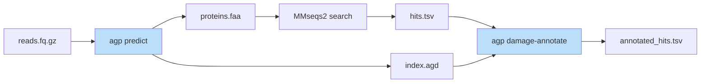
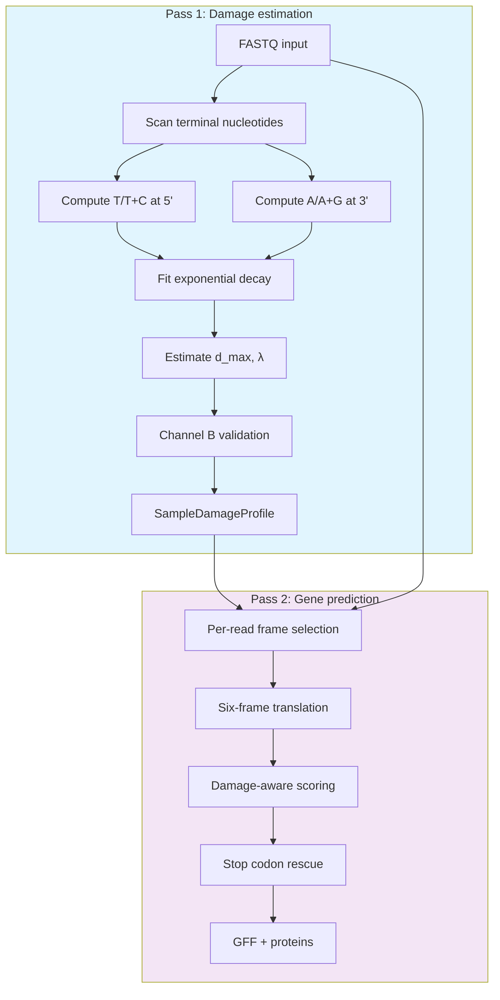
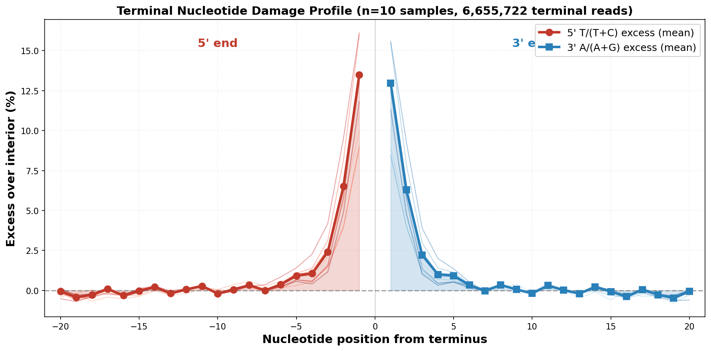
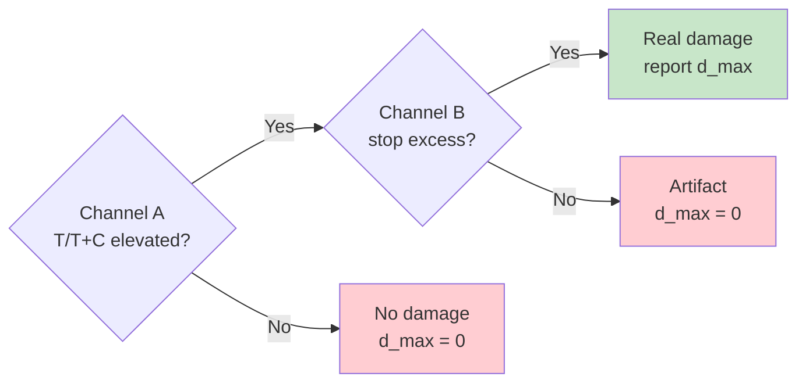
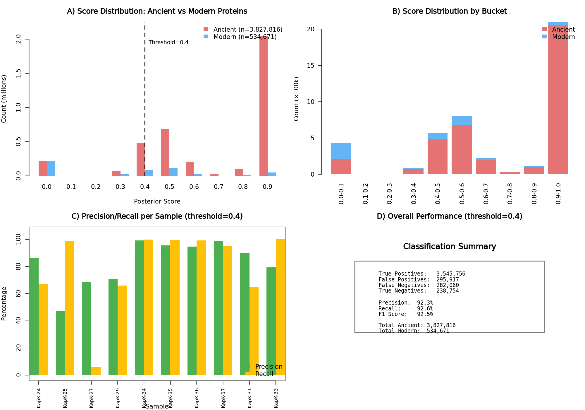

# AGP: Ancient Gene Predictor for damage-aware translation of ancient DNA

[](https://opensource.org/licenses/MIT)

AGP translates ancient DNA (aDNA) reads into proteins for functional annotation. It predicts protein-coding genes from short, degraded metagenomic sequences while accounting for post-mortem C→T and G→A deamination that corrupts standard translation.

## What AGP does

Ancient DNA reads are too short and fragmented for genome assembly. AGP translates them directly into proteins that can be searched against functional databases (KEGG, CAZy, viral protein databases) to identify metabolic pathways, enzyme functions, and viral content in ancient samples.

**Primary use cases:**
- Functional profiling of ancient environmental metagenomes (KEGG pathway analysis)
- Carbohydrate-active enzyme (CAZyme) discovery in permafrost and sediments
- Viral detection in ancient environmental samples
- Authentication of ancient proteins via damage patterns

## Features

- **Damage-aware translation**: Adjusts for C→T/G→A deamination that creates false stop codons
- **Per-protein damage scoring**: Identifies which proteins show authentic ancient damage patterns
- **Reference-free damage detection**: No alignment to reference genomes required
- **Two-channel validation**: Distinguishes real damage from natural sequence composition
- **High throughput**: ~20,000 reads/second with SIMD optimization

## Installation

Requires C++20 compiler (GCC 10+ or Clang 12+), CMake 3.18+, and zlib.

```bash
git clone https://github.com/genomewalker/agp.git
cd agp
mkdir build && cd build
cmake -DCMAKE_BUILD_TYPE=Release ..
make -j$(nproc)
```

## Quick start

### Basic gene prediction

```bash
agp predict -i reads.fq.gz -o predictions.gff --fasta-aa proteins.faa --adaptive
```

This produces:
- `predictions.gff`: Gene coordinates with damage scores
- `proteins.faa`: Translated proteins for database search

### Functional profiling pipeline



Search predicted proteins against KEGG for pathway analysis:

```bash
# 1. Predict genes with damage index
agp predict -i reads.fq.gz -o out.gff \
    --fasta-aa-masked search.faa \
    --damage-index out.agd \
    --adaptive

# 2. Search against KEGG (MMseqs2 with aDNA-optimized settings)
mmseqs easy-search search.faa kegg_genes.faa hits.tsv tmp/ \
    --sub-mat VTML20.out \
    --format-output "query,target,fident,alnlen,mismatch,gapopen,qstart,qend,tstart,tend,evalue,bits,qlen,tlen,qaln,taln"

# 3. Annotate hits with per-protein damage scores
agp damage-annotate -i hits.tsv --damage-index out.agd -o annotated_hits.tsv
```

The `--fasta-aa-masked` output replaces damage-induced stop codons with X for better database matching.

### Sample damage assessment

Check if a sample shows authentic ancient damage:

```bash
agp sample-damage reads.fq.gz
```

Output (JSON):
```json
{
  "d_max": 0.25,
  "lambda": 0.3,
  "damage_validated": true,
  "library_type": "double-stranded"
}
```

## Commands

### `agp predict`

Translates reads into proteins with damage-aware frame selection.

```
Usage: agp predict -i <input> -o <output> [options]

Required:
  -i, --input FILE       Input FASTQ/FASTA (gzip supported)
  -o, --output FILE      Output GFF3

Output:
  --fasta-aa FILE        Protein sequences (observed translation)
  --fasta-aa-masked FILE Protein sequences (damage stops masked as X)
  --fasta-nt FILE        Nucleotide sequences
  --damage-index FILE    Binary index for damage-annotate (.agd)
  --summary FILE         Sample statistics (JSON)

Parameters:
  --adaptive             Adaptive damage correction (recommended)
  --domain NAME          Taxonomic domain: gtdb, fungi, plant, viral,
                         vertebrate_mammalian, vertebrate_other,
                         invertebrate, protozoa (default: gtdb)
  --orf-min-aa N         Minimum protein length (default: 10)
  -t, --threads N        Thread count (default: auto)
```

### `agp sample-damage`

Estimates sample-wide damage rate without gene prediction.

```
Usage: agp sample-damage <input.fq.gz> [options]

Output fields:
  d_max              Maximum damage rate at read termini (0-1)
  lambda             Exponential decay constant
  damage_validated   True if damage confirmed by stop codon signal
  library_type       single-stranded or double-stranded
```

### `agp damage-annotate`

Annotates database hits with per-protein damage evidence. Compares observed proteins to reference proteins to identify damage-consistent amino acid substitutions (R→W, H→Y, Q→*, etc.).

```
Usage: agp damage-annotate -i <hits.tsv> --damage-index <index.agd> -o <output.tsv>

Required:
  -i, --hits FILE        MMseqs2 results (16-column format with qaln/taln)
  --damage-index FILE    AGP damage index from predict
  -o FILE                Output annotated TSV

Optional:
  --protein-summary FILE Per-protein aggregated statistics
  --corrected FILE       Reference-corrected protein FASTA
  --threshold FLOAT      Classification threshold (default: 0.7)
```

Output columns include:
- `p_read`: Per-read damage probability from prediction
- `ct_sites`, `ga_sites`: C→T and G→A substitution counts from alignment
- `posterior`: Bayesian damage probability combining terminal and alignment evidence
- `damage_class`: 3-state classification (ancient/uncertain/modern)
- `is_damaged`: Binary classification (posterior >= threshold)

### `agp damage-profile`

Computes position-wise damage profiles for proteins with sufficient coverage.

```
Usage: agp damage-profile -i <reads.fq> --hits <hits.tsv> -o <profile.tsv.gz>

Options:
  --aggregate        Position-wise summary across all proteins
  --min-reads N      Minimum reads per protein (default: 10)
```

### `agp validate`

Compares predictions against ground truth for benchmarking.

```
Usage: agp validate <predictions.gff> <reference.gff>
```

## Output formats

### GFF3

```
read_001  AGP  CDS  1  150  0.85  +  0  ID=gene_1;ancient_prob=0.72;damage_pct=15.3;conf=0.88
```

| Attribute | Description |
|-----------|-------------|
| ancient_prob | Probability read shows damage pattern (0-1) |
| damage_pct | Estimated damage percentage |
| conf | Prediction confidence from length and coding score |

### Damage Index (.agd)

Binary format for O(1) per-read damage lookup. Contains sequence length, frame, strand, damage probability, and terminal codon information. Required by `damage-annotate`.

### Annotated Hits TSV

Per-read output from `damage-annotate`:

| Column | Description |
|--------|-------------|
| p_read | Per-read damage probability from AGP predict |
| ct_sites | C→T substitution count at protein level |
| ga_sites | G→A substitution count at protein level |
| posterior | Bayesian posterior probability of damage |
| is_damaged | 1 if posterior >= threshold |
| syn_5prime | Synonymous C→T at 5' terminus (from damage index) |
| syn_3prime | Synonymous G→A at 3' terminus (from damage index) |

## How it works

### Two-pass architecture



**Pass 1** scans all reads to estimate sample-wide damage:
- Terminal nucleotide frequencies: T/(T+C) at 5', A/(A+G) at 3'
- Exponential decay fitting: δ(p) = δ_max · e^(-λp)
- Stop codon conversion rates for validation

**Pass 2** predicts genes using the calibrated damage model:
- Six-frame translation with damage-aware scoring
- Bayesian stop codon probability based on position
- Frame selection weighted by codon usage, hexamer patterns, and damage consistency

### Two-channel damage validation

Reference-free damage detection has a fundamental limitation: elevated T/(T+C) at read termini could be real C→T damage OR natural sequence composition.

AGP solves this with two independent signals:

**Channel A (Nucleotide frequencies)**: Measures T/(T+C) ratio at each position from 5' terminus. Real damage shows exponential decay from ~30% at position 0 to baseline (~25%) by position 15.

**Channel B (Stop codon conversion)**: Tracks CAA→TAA, CAG→TAG, CGA→TGA conversions. These can ONLY be elevated by real C→T damage. Interior reads provide baseline; terminal excess indicates authentic damage.

<p align="center">

</p>

*Terminal damage profiles showing characteristic "smiley" pattern: elevated T/(T+C) at 5' end and A/(A+G) at 3' end, decaying exponentially toward interior.*

**Decision logic:**



### Per-protein damage scoring

After database search, `damage-annotate` identifies damage-consistent amino acid substitutions by comparing query (observed) to target (reference) proteins:

| Reference | Observed | Damage Type | Codon Change |
|-----------|----------|-------------|--------------|
| R | W | C→T (5') | CGG→TGG |
| Q | * | C→T (5') | CAA→TAA |
| H | Y | C→T (5') | CAC→TAC |
| E | K | G→A (3') | GAA→AAA |
| D | N | G→A (3') | GAC→AAC |
| R | K | G→A (3') | AGA→AAA |

Positional probability weights these substitutions: sites near termini (where damage is expected) score higher than interior sites.

## Performance

Benchmarked on synthetic ancient DNA from the KapK community with known damage patterns and source proteins.

### Protein damage annotation

The `damage-annotate` command computes a Bayesian posterior probability for each protein hit using:
- **Terminal evidence**: Pre-mapping T/(T+C) damage signal from read termini
- **Site evidence**: Damage-consistent amino acid substitutions from alignment (R→W, H→Y, Q→*, etc.)

The Bayesian scoring combines both signals in log-odds space, providing principled uncertainty quantification and 3-state classification (ancient/uncertain/modern).

| Metric | Value |
|--------|-------|
| Protein-level AUC-ROC | **0.79** |
| Precision @ threshold 0.4 | 93% |
| Recall @ threshold 0.4 | 83% |

### Gene prediction

Benchmarked on 18.3M synthetic ancient DNA reads (10 KapK community samples) with known source proteins. Functional matching counts a hit as correct if it has ≥90% sequence identity to any reference protein.

**Functional matching (≥90% identity):**

| Method | Recall | Precision | Avg Identity |
|--------|--------|-----------|--------------|
| AGP | 67.6% | **97.2%** | **96.2%** |
| MMseqs2 blastx | **68.5%** | 96.3% | 94.8% |
| FGS-rs | 19.1% | 95.3% | 94.2% |

**Timing (4.4M reads, 8 threads):**

| Method | Predict | Search | Total |
|--------|---------|--------|-------|
| AGP | 149s | 4 min | ~6.5 min |
| MMseqs2 blastx | N/A | 10 min | ~10 min |
| FGS-rs | ~18s | 4 min | ~4.5 min |

**Key findings:**
- AGP and BLASTX have equivalent functional recall (~68%), both far exceed FGS-rs (19%)
- AGP produces +1.4% higher identity hits than BLASTX (better quality matches)
- AGP is ~1.5x faster than BLASTX (damage-aware frame selection vs 6-frame brute force)
- FGS-rs fails on ancient DNA because it treats damage-induced stop codons as real stops

### Throughput

~35,000 sequences/second for gene prediction (8 threads, SIMD optimization).

## Validation

AGP validation uses two complementary datasets: (1) synthetic reads from the KapK community with known per-read damage status, and (2) 31 real ancient metagenomes with metaDMG reference-based damage estimates.

### Protein-level damage classification

After database search, the `damage-annotate` command computes a Bayesian posterior probability for each protein hit:

$$\text{logit}(P_{\text{posterior}}) = \text{logit}(\pi) + \log BF_{\text{terminal}} + \log BF_{\text{sites}}$$

Where *π* is the prior probability of ancient origin, *BF_terminal* is the Bayes factor from terminal nucleotide patterns (p_read), and *BF_sites* is the Bayes factor from damage-consistent amino acid substitutions in the alignment (R→W, H→Y, Q→*, etc.).

We validated on 4.36M proteins from 10 synthetic KapK samples with known damage status:

| Metric | Value |
|--------|-------|
| Protein-level AUC-ROC | **0.79** |
| Precision @ threshold 0.4 | 93% |
| Recall @ threshold 0.4 | 83% |

The figure below shows precision-recall curves for Bayesian scoring versus the simpler weighted formula.

<p align="center">

</p>

**Why AUC 0.79?** This approaches the information-theoretic limit for reference-free classification. C→T damage produces thymine indistinguishable from natural T without a reference:

$$P(T \mid \text{damage}) = 0.25 + 0.75 \times d = 0.475 \quad \text{(at } d=30\%)$$

$$P(T \mid \text{no damage}) = 0.25$$

A single terminal position yields AUC ~0.61. AGP achieves 0.80 by combining terminal evidence with alignment-derived damage-consistent substitutions via Bayesian log-odds fusion.

### Sample-wide damage validation

AGP estimates sample-wide damage without reference alignment using two-channel validation: terminal T/(T+C) elevation (Channel A) combined with stop codon conversion rates (Channel B). We validated against metaDMG on 31 real ancient metagenomes:

| Sample | metaDMG (%) | AGP d_max (%) | Channel B LLR | Decision |
|--------|-------------|---------------|---------------|----------|
| low_001 | 0.48 | 0.00 | -24,707 | No damage (artifact) |
| low_002 | 0.53 | 0.00 | -365 | No damage (artifact) |
| low_005 | 8.37 | 6.27 | +808 | Validated |
| low_009 | 31.47 | 9.06 | +39,631 | Validated |
| 69_34 | 39.50 | 39.00 | +5,332,371 | Validated |
| 119_48 | 44.98 | 44.00 | +3,818,288 | Validated |
| 75_205D | 55.82 | 42.00 | +1,481,034 | Validated |

The scatter plot below shows the correlation between AGP and metaDMG estimates across all 31 samples:

<p align="center">

</p>

Correlation r = 0.81 across the full 0–55% damage range. The +4.4% bias reflects different estimands: metaDMG analyzes only aligned reads, while AGP analyzes all reads. Channel B prevents false positives—samples low_001–low_004 show elevated terminal T/(T+C) but negative Channel B LLR, correctly rejected as compositional artifacts.

## Methods

### Damage model

Post-mortem deamination follows exponential decay from fragment termini:

$$\delta(p) = d_{\text{max}} \cdot e^{-\lambda p}$$

Where $d_{\text{max}}$ is maximum damage at terminus, $\lambda$ is decay constant (0.2–0.5), and $p$ is position from terminus. Half-life: $t_{1/2} = \ln(2) / \lambda \approx 1.4\text{–}3.5$ positions.

### Channel A: Nucleotide frequencies

Measures thymine enrichment at 5' terminal positions:

$$r_A(p) = \frac{T_p}{T_p + C_p}$$

Expected ratio under damage:

$$\mathbb{E}[r_A(p)] = b_T + (1 - b_T) \cdot d_{\text{max}} \cdot e^{-\lambda p}$$

Where $b_T$ is baseline T/(T+C) from interior positions. Log-likelihood ratio for decay vs. constant:

$$\text{LLR}_A = \sum_{p=0}^{P} \left[ \log \mathcal{L}(k_p | n_p, r_{\text{exp}}(p)) - \log \mathcal{L}(k_p | n_p, b_T) \right]$$

### Channel B: Stop codon conversion

Real C→T damage converts CAA→TAA, CAG→TAG, CGA→TGA. Stop conversion rate:

$$r_B(p) = \frac{\text{stops}_p}{\text{stops}_p + \text{preimage}_p}$$

Fit via weighted least squares: $y_p = a + c \cdot e^{-\lambda p}$

Decision: If $c > 0$ and $\text{LLR}_B > 0$ → **VALIDATED**

### Per-read damage scoring

Posterior probability for each read using Bayes' rule. At terminal position $i$ with observed base $B$:

$$P(B=T | \text{damage}) = b_{TC} + (1 - b_{TC}) \cdot d_{\text{max}} \cdot e^{-\lambda i}$$

$$P(B=T | \text{no damage}) = b_{TC}$$

Log-likelihood ratio accumulation across terminal positions:

$$\text{LLR} = \sum_{i \in \text{terminal}} \log \frac{P(B_i | \text{damage})}{P(B_i | \text{no damage})}$$

Base posterior via logistic transform:

$$P_{\text{base}}(\text{damage}) = \sigma\left(\text{logit}(\pi_0) + \text{LLR}\right)$$

Reported read-level score with Channel B modulation ($\gamma_B \in \{0, 0.5, 1\}$):

$$p_{\text{read}} = \gamma_B \cdot P_{\text{base}}(\text{damage})$$

### Stop codon rescue

For a stop codon at position p from 5' terminus, the probability it arose from damage:

$$P(\text{damage} \mid \text{stop}) = \frac{P(\text{stop} \mid \text{damage}) \cdot P(\text{damage})}{P(\text{stop})}$$

Where:
- P(stop | damage) = probability of convertible precursor (CAA, CAG, CGA)
- P(damage) = δ(p) from the damage model
- P(stop) = observed stop frequency at that position

High P(damage | stop) triggers X-masking in `--fasta-aa-masked` output.

### Frame scoring

Frame selection combines multiple signals with learned weights:

| Signal | Weight |
|--------|--------|
| Codon usage bias | 0.15 |
| Stop codon penalty | 0.28 |
| Dicodon/hexamer patterns | 0.13 |
| Amino acid composition | 0.10 |
| GC3 content | 0.05 |
| Damage-frame consistency | variable |

In damage-aware mode, stop penalties are weighted by (1 - P_damage), reducing penalties for likely damage-induced stops.

### Bayesian damage score

The per-protein damage score uses Bayesian log-odds fusion to integrate pre-mapping and post-mapping evidence:

$$\text{logit}(P_{\text{posterior}}) = \text{logit}(\pi) + \log BF_{\text{terminal}} + \log BF_{\text{sites}}$$

Where:
- $\pi$ is the prior probability of damage (from sample-level estimate)
- $BF_{\text{terminal}}$ is the Bayes factor from terminal nucleotide patterns (p_read)
- $BF_{\text{sites}}$ is the Bayes factor from damage-consistent amino acid substitutions (R→W, H→Y, Q→*, etc.)

This principled approach provides calibrated uncertainty quantification and enables 3-state classification (damaged/uncertain/non-damaged).

### Domain-specific models

AGP includes pre-trained hexamer frequency tables for different taxonomic groups, enabling accurate frame selection across diverse organisms:

| Domain | Source | CDS sequences | Description |
|--------|--------|---------------|-------------|
| gtdb | GTDB r220 | 405M | Bacteria and archaea (default) |
| fungi | RefSeq | 6.8M | Fungal eukaryotes |
| plant | RefSeq | 9.2M | Land plants |
| protozoa | RefSeq | 1.2M | Single-celled eukaryotes |
| invertebrate | RefSeq | 12.9M | Invertebrate animals |
| vertebrate_mammalian | RefSeq | 12.9M | Mammals |
| vertebrate_other | RefSeq | 21.3M | Non-mammalian vertebrates |
| viral | RefSeq | 0.7M | Viruses |

Each domain has three types of hexamer tables:
- **Overall frequencies**: Codon-pair (dicodon) patterns for coding potential scoring
- **Positional frequencies**: Position-specific patterns for start/internal/end regions
- **Damage likelihood ratios**: Log-likelihood ratios for damage-consistent patterns

For ancient environmental metagenomes, the default `gtdb` domain works well since bacterial sequences typically dominate. Use `--domain` to specify a different taxonomic group when analyzing samples with known composition.

## Citation

If you use AGP in your research, please cite:

> **Two-million-year-old microbial communities from the Kap København Formation in North Greenland**
> Fernandez-Guerra A, Wörmer L, Borrel G, Delmont TO, Elberling B, Elvert M, Eren AM, Gribaldo S, Henriksen RA, Hinrichs K-U, Jochheim A, Korneliussen TS, Krupovic M, Larsen NK, Perez-Laso R, Pedersen MW, Pedersen VK, Ruter AH, Sand KK, Sikora M, Steinegger M, Veseli I, Wang Y, Zhao L, Žure M, Kjær KH, Willerslev E.
> *bioRxiv* (2025)
> DOI: [10.1101/2023.06.10.544454](https://doi.org/10.1101/2023.06.10.544454)

```bibtex
@article{fernandezguerra2025,
  title={Two-million-year-old microbial communities from the Kap København Formation in North Greenland},
  author={Fernandez-Guerra, Antonio and W{\"o}rmer, Lars and Borrel, Guillaume and Delmont, Tom O and Elberling, Bo and Elvert, Marcus and Eren, A Murat and Gribaldo, Simonetta and Henriksen, Rasmus Amund and Hinrichs, Kai-Uwe and Jochheim, Annika and Korneliussen, Thorfinn S and Krupovic, Mart and Larsen, Nicolaj K and Perez-Laso, Rafael and Pedersen, Mikkel Winther and Pedersen, Vivi K and Ruter, Anthony H and Sand, Karina K and Sikora, Martin and Steinegger, Martin and Veseli, Iva and Wang, Yucheng and Zhao, Lei and {\v{Z}}ure, Marina and Kj{\ae}r, Kurt H and Willerslev, Eske},
  journal={bioRxiv},
  year={2025},
  doi={10.1101/2023.06.10.544454}
}
```

## License

MIT License - see LICENSE file for details.
