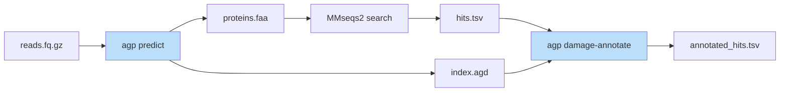
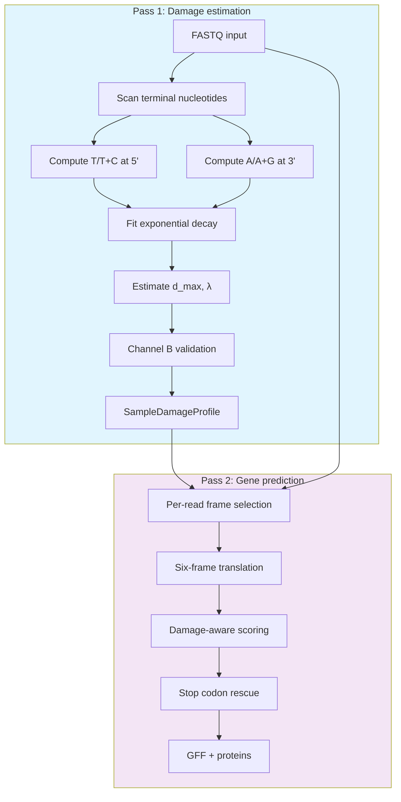
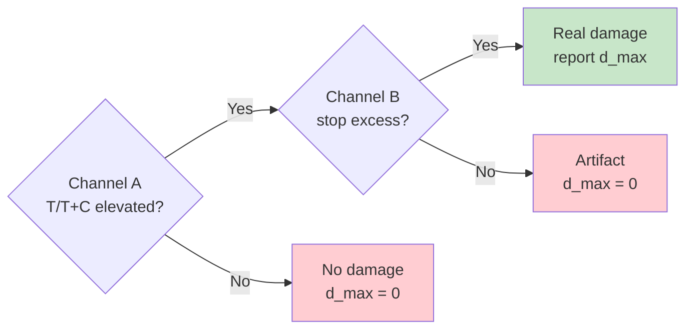

# AGP - Ancient Gene Predictor

[](https://opensource.org/licenses/MIT)

AGP translates ancient DNA reads into proteins for functional annotation, accounting for post-mortem C→T and G→A deamination that corrupts standard translation.

---

## Key features

| Feature | Description |
|---------|-------------|
| **Damage-aware translation** | Adjusts for C→T/G→A deamination that creates false stop codons |
| **Per-protein damage scoring** | Identifies which proteins show authentic ancient damage |
| **Reference-free detection** | No alignment to reference genomes required |
| **Two-channel validation** | Distinguishes real damage from sequence composition |
| **High throughput** | ~20,000 reads/second with SIMD optimization |

---

## Installation

```bash
git clone https://github.com/genomewalker/agp.git
cd agp
mkdir build && cd build
cmake -DCMAKE_BUILD_TYPE=Release ..
make -j$(nproc)
```

> Requires C++20 compiler (GCC 10+ or Clang 12+), CMake 3.18+, and zlib.

---

## Quick start

### Predict genes

```bash
agp predict -i reads.fq.gz -o predictions.gff --fasta-aa proteins.faa --adaptive
```

### Full pipeline with damage annotation



```bash
# 1. Predict genes with damage index
agp predict -i reads.fq.gz -o out.gff \
    --fasta-aa-masked search.faa \
    --damage-index out.agd \
    --adaptive

# 2. Search against database
mmseqs easy-search search.faa kegg_genes.faa hits.tsv tmp/ \
    --sub-mat VTML20.out \
    --format-output "query,target,fident,alnlen,mismatch,gapopen,qstart,qend,tstart,tend,evalue,bits,qlen,tlen,qaln,taln"

# 3. Annotate with damage scores
agp damage-annotate -i hits.tsv --damage-index out.agd -o annotated_hits.tsv
```

### Check sample damage

```bash
agp sample-damage reads.fq.gz
```

```json
{"d_max": 0.25, "lambda": 0.3, "damage_validated": true, "library_type": "double-stranded"}
```

---

## Performance

### Protein damage annotation

The primary output: identifying which proteins carry authentic ancient damage.

```math
score = 0.80 \cdot p_{read} + 0.40 \cdot I_{nonsyn} + 0.05 \cdot I_{syn}
```

| Metric | Value |
|--------|-------|
| **AUC-ROC** | 0.78 |
| **Precision** (threshold 0.7) | 92% |
| **Recall** (threshold 0.7) | 81% |
| Per-protein precision (any damage) | 73% |
| Per-protein precision (AA-changing) | 67% |

<p align="center">

</p>

### Gene prediction comparison

| Method | Recall | Precision | F1 |
|--------|--------|-----------|-----|
| **AGP (adaptive)** | **76.4%** | **100%** | **86.6%** |
| MMseqs2 blastx | 76.2% | 99.8% | 86.4% |
| AGP (6-frame) | 74.2% | 100% | 85.2% |
| FGS-rs | 29.8% | 100% | 45.9% |

> FGS-rs fails on ancient DNA because it treats damage-induced stops as real stops.

### Sample damage estimation

Validated against metaDMG on 31 real ancient environmental samples:

| Metric | Value |
|--------|-------|
| Correlation with metaDMG | r = 0.81 |
| Mean absolute error | 8.0% |

<p align="center">

</p>

---

## How it works

### Two-pass architecture



### Two-channel damage validation

Reference-free damage detection can confuse elevated T/(T+C) from real damage with natural sequence composition. AGP uses two independent signals:

| Channel | Signal | What it detects |
|---------|--------|-----------------|
| **A** | T/(T+C) at 5' terminus | Elevated by damage OR composition |
| **B** | CAA→TAA, CAG→TAG, CGA→TGA | Elevated ONLY by real C→T damage |



<p align="center">

</p>

*Characteristic "smiley" pattern: elevated T/(T+C) at 5' and A/(A+G) at 3', decaying exponentially toward interior.*

### Damage-consistent substitutions

After database search, `damage-annotate` identifies substitutions matching damage patterns:

| Reference | Observed | Damage | Codon |
|-----------|----------|--------|-------|
| R | W | C→T (5') | CGG→TGG |
| Q | * | C→T (5') | CAA→TAA |
| H | Y | C→T (5') | CAC→TAC |
| E | K | G→A (3') | GAA→AAA |
| D | N | G→A (3') | GAC→AAC |

---

## Commands

### `agp predict`

```
Usage: agp predict -i <input> -o <output> [options]

Required:
  -i, --input FILE       Input FASTQ/FASTA (gzip supported)
  -o, --output FILE      Output GFF3

Output options:
  --fasta-aa FILE        Protein sequences (observed)
  --fasta-aa-masked FILE Protein sequences (damage stops as X)
  --damage-index FILE    Binary index for damage-annotate (.agd)

Parameters:
  --adaptive             Adaptive damage correction (recommended)
  --domain NAME          gtdb|fungi|plant|viral|vertebrate_mammalian|
                         vertebrate_other|invertebrate|protozoa
  -t, --threads N        Thread count (default: auto)
```

### `agp damage-annotate`

```
Usage: agp damage-annotate -i <hits.tsv> --damage-index <index.agd> -o <output.tsv>

Required:
  -i, --hits FILE        MMseqs2 results (16-column format)
  --damage-index FILE    AGP damage index from predict
  -o FILE                Output annotated TSV

Output columns: p_read, ct_sites, ga_sites, combined_score, is_damaged
```

### `agp sample-damage`

```
Usage: agp sample-damage <input.fq.gz>

Output: JSON with d_max, lambda, damage_validated, library_type
```

---

## Methods

### Damage model

Post-mortem deamination follows exponential decay:

```math
\delta(p) = \delta_{max} \cdot e^{-\lambda p} + \delta_{background}
```

- δ_max = maximum damage rate (typically 0.1–0.5)
- λ = decay constant (typically 0.2–0.4)
- p = position from terminus

### Stop codon rescue

Probability a stop arose from damage:

```math
P(damage \mid stop) = \frac{P(stop \mid damage) \cdot P(damage)}{P(stop)}
```

High P(damage|stop) triggers X-masking in `--fasta-aa-masked` output.

### Frame scoring

| Signal | Weight |
|--------|--------|
| Stop codon penalty | 0.28 |
| Codon usage bias | 0.15 |
| Dicodon/hexamer patterns | 0.13 |
| Amino acid composition | 0.10 |
| GC3 content | 0.05 |

### Domain-specific models

Pre-trained hexamer tables for different taxonomic groups:

| Domain | Source | CDS | Description |
|--------|--------|-----|-------------|
| gtdb | GTDB r220 | 405M | Bacteria/archaea (default) |
| fungi | RefSeq | 6.8M | Fungi |
| plant | RefSeq | 9.2M | Plants |
| viral | RefSeq | 0.7M | Viruses |
| vertebrate_mammalian | RefSeq | 12.9M | Mammals |
| vertebrate_other | RefSeq | 21.3M | Other vertebrates |
| invertebrate | RefSeq | 12.9M | Invertebrates |
| protozoa | RefSeq | 1.2M | Protozoa |

---

## Citation

> **AGP: Ancient Gene Predictor for damage-aware translation of ancient DNA**
> Fernandez-Guerra A, et al. (2026)
> *bioRxiv* (preprint) DOI: [pending]

```bibtex
@article{agp2026,
  title={AGP: Ancient Gene Predictor for damage-aware translation of ancient DNA},
  author={Fernandez-Guerra, Antonio and others},
  journal={bioRxiv},
  year={2026}
}
```

---

## License

MIT License - see [LICENSE](LICENSE) for details.
