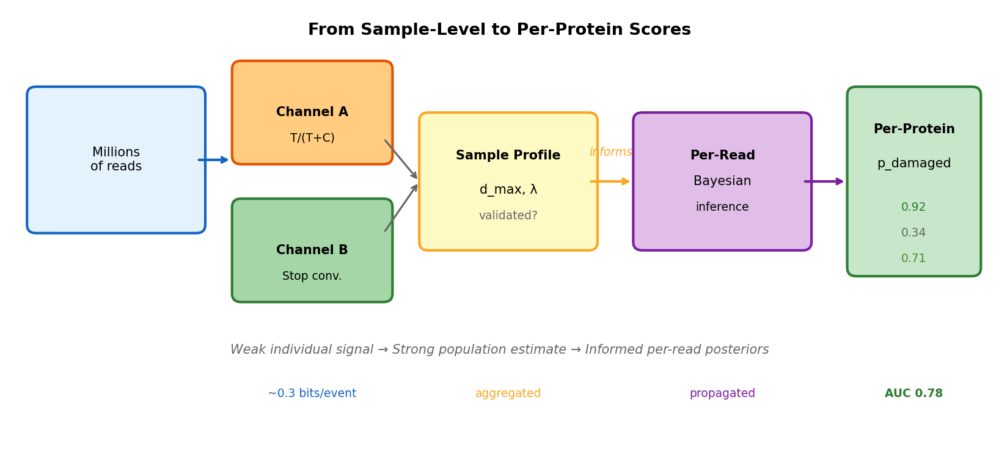
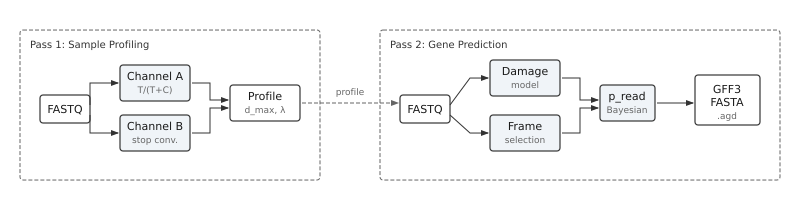
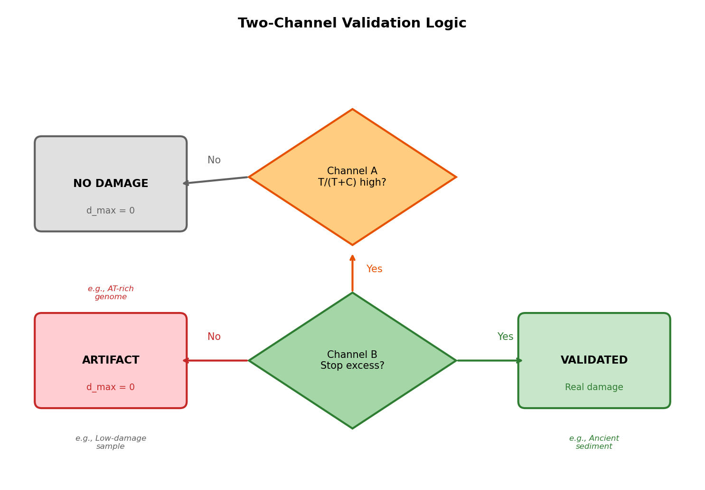
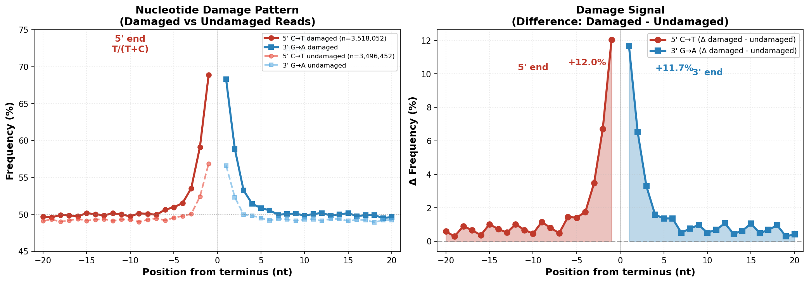

# AGP - Damage-Aware Gene Predictor

AGP predicts genes from ancient DNA reads and assigns each protein a damage score. Damage is used as a contamination-screening proxy: damage-positive molecules are more likely to represent authentic ancient signal, while no-damage molecules are more likely to be modern contamination.

## The problem

When you sequence ancient environmental samples—permafrost, sediments, dental calculus—you get a mixture. Some DNA fragments are genuinely ancient, carrying characteristic C→T damage from thousands of years of cytosine deamination. Other fragments are modern contamination that entered during excavation, storage, or lab work.

Alignment-based damage tools profile damage from mapped reads. This works well when you have good references and high mapping rates. But ancient metagenomes often contain taxa with incomplete or missing references—the reads don't map, so they get no damage assessment. And even when mapping succeeds, you get damage rates at the taxon level, not at the level of individual molecules.

AGP addresses two gaps:

1. **Reference incompleteness**: AGP works directly on raw reads without requiring alignment. Reads from unknown taxa, divergent viruses, or poorly-represented lineages all get damage-scored.

2. **Molecule-level granularity**: AGP scores each predicted protein individually. Instead of "reads mapping to *Methanobacterium* show 25% damage," you get "this specific protein has `p_damaged = 0.92`." This lets you weight functional annotations by damage—asking not just "what functions are present?" but "which functions show damage enrichment?"

The combination of reference-free operation and per-protein scoring makes AGP particularly useful for functional profiling (KEGG, CAZymes) and viral analysis, where references are often incomplete and molecule-level authentication matters.

## Why this is hard

This problem is fundamentally difficult—not just an engineering challenge, but an information-theoretic one.

### No reference for comparison

When you align reads to a reference, detecting damage is straightforward—count C→T mismatches at terminal positions. But AGP operates without alignment. All you see is a T at position 3—was it always a T, or was it a C that deaminated over thousands of years? At the single-read level, these are indistinguishable.

AGP must infer damage from statistical patterns across the dataset, not from direct comparison to a known sequence. This requires aggregating evidence from millions of reads to estimate the sample's damage characteristics, then propagating that information back to score individual molecules.

### Compositional confounding

Here's a trap that catches naive approaches: AT-rich organisms naturally have high thymine frequencies at read termini. A bacterium with 70% AT content will show elevated T/(T+C) ratios that look exactly like C→T damage. If you only measure nucleotide frequencies, you'll classify every AT-rich organism as "damage-positive" regardless of whether any deamination occurred. This is why single-channel damage detection produces false positives—compositional variation masquerades as damage.

### Weak per-read signal

Even when damage is real, the per-read signal is weak. A typical damage-positive read has 1-2 C→T events in the terminal 10 positions. Each event provides roughly 0.3 bits of information about damage status. Information theory tells us the theoretical ceiling: with this little signal, single-read classification cannot exceed AUC ~0.60, no matter how sophisticated your model.



AGP exceeds this limit (achieving AUC 0.78) through a key insight: while individual reads are ambiguous, millions of reads together reveal the sample's damage pattern. AGP first estimates sample-level damage parameters from the full dataset, then propagates this information back to score individual reads. It also combines two orthogonal signals—nucleotide frequencies and stop codon conversion—that are statistically independent given the true damage state.

### Damage breaks ORF prediction

DNA damage doesn't just complicate contamination screening—it actively breaks gene prediction. C→T deamination converts three codons to stop codons: CAA→TAA, CAG→TAG, and CGA→TGA. Standard gene predictors see a stop codon and terminate the ORF. On a 30% damage-positive sample, this fragments most predictions. AGP must distinguish real stop codons (where translation actually terminated) from damage-induced stops (where glutamine or arginine became spurious terminators).

### Short fragments

Ancient DNA is heavily fragmented. Typical read lengths are 50-80 bp, encoding proteins of just 15-25 amino acids. Short proteins have fewer hexamers for coding potential assessment, fewer terminal positions for damage signal, and higher frame ambiguity (with 6 possible reading frames, short sequences often score similarly in multiple frames). Every aspect of the problem gets harder as fragments get shorter.

## Technical details

### Adaptive damage correction (`--adaptive`)

When enabled, AGP adjusts its frame selection based on the sample's damage profile:
- **Stop codon rescue**: Converts likely damage-induced stops (TAA, TAG, TGA from CAA, CAG, CGA) to their original amino acids (Q, Q, R) when positional damage probability is high
- **Relaxed ORF penalties**: Reduces the penalty for internal stops in high-damage reads
- **Hexamer-guided correction**: Only corrects when local hexamer context improves

Without `--adaptive`, AGP treats all stops as real, causing fragmented predictions in damage-positive samples.

### Damage-masked proteins (`--fasta-aa-masked`)

Outputs proteins with damage-prone residues masked as 'X':
- Positions where C→T or G→A damage likely altered the amino acid
- Masking threshold based on positional damage probability

Use masked proteins for database search—'X' matches any residue in alignment, preventing false negatives from damage-induced substitutions.

### Hexamer scoring

AGP uses position-specific hexamer (6-mer) frequencies to identify coding regions:
- **Dicodon context**: Hexamers span two adjacent codons, capturing codon pair bias
- **Domain-specific tables**: Pre-computed from GTDB, fungi, plants, viral, vertebrate, invertebrate, protozoa genomes
- **Frame discrimination**: Coding hexamers score higher than non-coding; correct frame scores higher than shifted frames

Hexamer scoring provides the primary signal for frame selection. Damage-aware scoring adjusts this when terminal damage might create false stops.

### VTML20 for damage-tolerant search

AGP recommends VTML20 substitution matrix for MMseqs2/DIAMOND searches:
- **Tolerates damage substitutions**: VTML20 scores damage-induced changes (D→N, E→K, R→W) less harshly than BLOSUM
- **Optimized for divergent proteins**: Better sensitivity for short, divergent fragments
- **Paired with relaxed thresholds**: Lower identity (50%) and e-value (10.0) to catch damage-altered hits

```bash
mmseqs easy-search query.faa db.faa hits.tsv tmp/ \
  --sub-mat VTML20.out --seed-sub-mat VTML20.out \
  -e 10.0 --min-seq-id 0.5
```

### Confidence score (`conf`)

Each prediction includes a confidence score computed from protein length, with optional blending of coding probability:

$$\text{length\_conf} = \frac{1}{1 + e^{-0.12 \times (\text{length} - 25)}}$$

If coding probability is available:

$$\text{conf} = \sqrt{\text{length\_conf} \times \text{coding\_prob}}$$

Otherwise:

$$\text{conf} = \text{length\_conf}$$

| Length (aa) | Conf | Interpretation |
|-------------|------|----------------|
| 15 | 0.38 | Low confidence—short fragment |
| 20 | 0.50 | Borderline |
| 30 | 0.73 | Good confidence |
| 40 | 0.88 | High confidence |
| 50+ | 0.95+ | Very high confidence |

Filter by `conf >= 0.5` to remove unreliable short predictions. Note that `conf` is a ranking/filtering score, not a formal posterior probability.

### Library types (ss vs ds)

AGP auto-detects library type from damage patterns:

| Type | Pattern | Detection |
|------|---------|-----------|
| **Single-stranded (ss)** | C→T at 5', C→T at 3' | Same direction both ends |
| **Double-stranded (ds)** | C→T at 5', G→A at 3' | Complementary pattern |

Use `--library-type ss` or `--library-type ds` to override auto-detection.

### Position-0 artifact detection

Adapter ligation can deplete T at position 0, masking damage signal:

```
Position:  0    1    2    3    4    ...
T shift:  -8%  +7%  +5%  +3%  +2%   (artifact: pos0 depleted)
```

AGP detects this and uses position 1 instead of position 0 for damage estimation. Check `position_0_artifact_5prime` in JSON output.

## How AGP works

### Two-pass architecture



**Pass 1** scans all reads to build a sample-wide damage profile using two independent channels. **Pass 2** uses this profile to score each read and predict genes with damage-aware frame selection.

### Two-channel damage validation

The key innovation in AGP is two-channel validation. Instead of relying on a single signal that can be confounded, AGP requires two independent lines of evidence to agree before calling damage "real."

**Channel A** measures nucleotide frequencies: the ratio of T to (T+C) at terminal positions. In damage-positive samples, this ratio is elevated because C→T deamination converts cytosines to thymines. But here's the problem—AT-rich organisms also have high T/(T+C), even without damage.

**Channel B** provides the "smoking gun." It tracks stop codon conversion: the rate at which CAA, CAG, and CGA codons (encoding glutamine and arginine) appear as TAA, TAG, and TGA (stop codons) at terminal positions. This can only happen through C→T damage. An AT-rich genome might have lots of natural T, but it won't have elevated stop conversion rates at termini—only real damage does that.

| Channel | Signal | What it detects |
|---------|--------|-----------------|
| **A** | T/(T+C) enrichment at termini | Elevated T—could be damage OR AT-rich genome |
| **B** | Stop codon conversion (CAA/CAG/CGA → TAA/TAG/TGA) | Only real C→T damage creates stops from these codons |

The decision logic is simple but powerful:



If Channel A fires but Channel B doesn't, AGP concludes the signal is compositional bias, not damage. This is how AGP correctly reports `d_max = 0%` for AT-rich no-damage samples that would fool single-channel approaches.

### Per-protein damage scores

Once AGP has validated the sample's damage pattern, it scores each predicted protein individually. `p_damaged` summarizes terminal damage evidence for that molecule under the sample-level model.

```
Protein A: p_damaged = 0.92  →  strong damage signal
Protein B: p_damaged = 0.34  →  weak/no damage signal
Protein C: p_damaged = 0.71  →  moderate damage signal
```

These aren't arbitrary scores—they're calibrated damage scores. High `p_damaged` indicates the molecule likely underwent cytosine deamination, which correlates with sample authenticity but is not proof on its own.

---

## Use cases

### Functional profiling

The real power of per-protein damage scores emerges in functional analysis. Instead of asking "Does this sample show damage?" you can ask "Which pathways show damage enrichment?"

Consider a permafrost metagenome. You find genes for methanogenesis, nitrogen fixation, and carbohydrate degradation. Sample-level statistics tell you the overall damage rate, but not which pathways carry the damage signal versus which are likely modern contamination.

With AGP, you compute damage-weighted abundances:

```
A_damage     = Σ(abundance × p_damaged)
A_no_damage  = Σ(abundance × (1 - p_damaged))
```

Now you can make statements like: "Methanogenesis genes show 85% damage-weighted abundance, while nitrogen fixation shows only 20%—suggesting the methanogenesis signal comes primarily from damage-positive molecules while nitrogen fixation is mostly no-damage."

Questions you can answer:
- Which KEGG modules show damage enrichment?
- Do CAZyme profiles differ between damage-positive and no-damage fractions?
- Which functions are associated with damage-positive vs no-damage molecules?

### Viral analysis

Virome analysis has a specific challenge: viral nucleotide sequences evolve so rapidly that alignment-based approaches often fail. Older viral sequences can diverge beyond recognition at the nucleotide level.

The solution is protein-based analysis. Viral proteins—especially structural proteins like capsids and functional proteins like polymerases—are far more conserved than nucleotides. AGP translates reads to protein, letting you search against viral protein databases (IMGVR, RefSeq Viral, etc.) where nucleotide search would fail.

But protein-based viral discovery has its own problem: how do you distinguish damage-positive viral hits from no-damage contamination? This is where AGP's per-protein damage scores become essential:

- Assess that capsid fragment: `p_damaged = 0.89` → strong damage signal
- Flag potential contamination: viral hits clustering at `p_damaged < 0.3` → weak damage, possibly modern
- Compare viral families: which groups show consistently high vs low damage scores?

The combination of protein-based sensitivity and per-molecule damage scoring makes virome analysis tractable when contamination screening is required.

---

## Quick start

### Installation

```bash
git clone https://github.com/genomewalker/agp.git
cd agp
mkdir build && cd build
cmake -DCMAKE_BUILD_TYPE=Release ..
make -j$(nproc)
```

Requires: C++20 compiler (GCC 10+), CMake 3.18+, zlib.

### Basic usage

```bash
# Predict genes from ancient DNA
agp predict -i reads.fq.gz -o predictions.gff --fasta-aa proteins.faa

# Estimate sample-wide damage
agp sample-damage reads.fq.gz
```

### Full pipeline

```bash
# Step 1: Predict genes with damage index
agp predict -i reads.fq.gz -o out.gff --fasta-aa-masked search.faa --damage-index out.agd --adaptive

# Step 2: Search against database (MMseqs2 with VTML20)
mmseqs easy-search search.faa database.faa hits.tsv tmp/ \
  --sub-mat VTML20.out \
  --format-output "query,target,fident,alnlen,mismatch,gapopen,qstart,qend,tstart,tend,evalue,bits,qlen,tlen,qaln,taln"

# Step 3: Annotate hits with damage information
agp damage-annotate -i hits.tsv --damage-index out.agd -o annotated.tsv
```

Each annotated protein gets:
- `p_damaged`: read-level damage score from AGP (typically 0–1)
- `combined_score`: weighted damage evidence (`0.80×p_read + 0.40×has_nonsyn + 0.05×has_syn`)

`combined_score` is a decision score (not a probability) and can exceed 1.0 in edge cases.

---

## Mathematical foundations

### Damage profile


*Terminal nucleotide damage profiles showing exponential decay from 5' and 3' ends.*

Damage-associated cytosine deamination follows exponential decay from read termini:

$$\delta(p) = d_{\max} \cdot e^{-\lambda p}$$

Where:
- $d_{\max}$ = maximum damage rate at terminal position
- $\lambda$ = decay rate constant (typically 0.2–0.5)
- $p$ = distance from terminus in nucleotides

Half-life: $t_{1/2} = \ln(2) / \lambda \approx 1.4\text{–}3.5$ positions for $\lambda \in [0.2, 0.5]$.

### Channel A: Nucleotide frequencies

Measures thymine enrichment at 5' terminal positions:

$$r_A(p) = \frac{T_p}{T_p + C_p}$$

Expected ratio under damage:

$$\mathbb{E}[r_A(p)] = b_T + (1 - b_T) \cdot d_{\max} \cdot e^{-\lambda p}$$

Where $b_T$ is the baseline T/(T+C) from interior positions.

Log-likelihood ratio for decay vs. constant:

$$\text{LLR}_A = \sum_{p=0}^{P} \left[ \log \mathcal{L}(k_p | n_p, r_{\text{exp}}(p)) - \log \mathcal{L}(k_p | n_p, b_T) \right]$$

### Channel B: Stop codon conversion

Real C→T damage converts:
- CAA (Gln) → **TAA** (stop)
- CAG (Gln) → **TAG** (stop)
- CGA (Arg) → **TGA** (stop)

Stop conversion rate:

$$r_B(p) = \frac{\text{stops}_p}{\text{stops}_p + \text{preimage}_p}$$

Fit via weighted least squares:

$$y_p = a + c \cdot e^{-\lambda p}$$

Decision: If $c > 0$ and $\text{LLR}_B > 0$ → **VALIDATED**

### Nucleotide-level pattern



*Classic terminal damage profile: C→T at 5' terminus, G→A at 3' terminus.*

### Per-read damage scoring

Posterior probability for each read:

$$P(\text{damage} | \text{obs}) = \frac{P(\text{obs} | \text{damage}) \cdot P(\text{damage})}{P(\text{obs})}$$

At terminal position $i$ with observed base $B$:

$$P(B=T | \text{damage}) = b_{TC} + (1 - b_{TC}) \cdot d_{\max} \cdot e^{-\lambda i}$$

$$P(B=T | \text{no\_damage}) = b_{TC}$$

Log-likelihood ratio accumulation:

$$\text{LLR} = \sum_{i \in \text{terminal}} \log \frac{P(B_i | \text{damage})}{P(B_i | \text{no\_damage})}$$

Base posterior via logistic transform:

$$P_{\text{base}}(\text{damage}) = \sigma\left(\text{logit}(\pi_0) + \text{LLR}\right)$$

Reported read-level score:

$$p_{\text{read}} = \gamma_B \cdot P_{\text{base}}(\text{damage})$$

Where $\gamma_B$ is Channel B modulation (0, 0.5, or 1.0 based on validation). Because of this modulation, `p_read`/`p_damaged` is a calibrated damage score used for ranking and aggregation; when $\gamma_B \neq 1$, it is not a pure posterior probability.

---

## Validation

Validating damage-aware gene prediction is challenging because there is no single gold standard. The task spans multiple capabilities—gene prediction, damage estimation, and damage classification—each requiring different benchmarks. We combine synthetic data with known provenance and real archaeological samples validated against reference-based methods.

AGP performs three distinct tasks that each require independent validation:

1. **Gene prediction**: Selecting the correct reading frame and strand for translation. Benchmarked against ground-truth gene assignments from synthetic metagenomes.
2. **Sample-wide damage estimation**: Quantifying the overall damage rate for a sample. Validated against metaDMG, the reference standard that estimates damage by aligning reads to reference genomes.
3. **Per-read damage classification**: Assigning damage scores to individual reads. Evaluated using receiver operating characteristic (ROC) curves against ground-truth damage annotations.

Ground truth comes from two sources. The **KapK synthetic community** contains gargammel-simulated reads from 58 damage-injected and 42 no-damage reference genomes, with damage rates spanning 0–35%. Each read has a known gene assignment, true reading frame, true strand, and per-position damage annotation. We also validate on **31 real archaeological metagenomes** where AGP estimates can be compared against metaDMG reference-based damage rates.

### Read-level classification

Beyond sample-level estimation, AGP assigns a per-read damage score (`p_read`) reflecting whether an individual read shows damage-consistent patterns. After database search, the `damage-annotate` command combines `p_read` with alignment-derived evidence (amino acid substitutions matching C→T/G→A patterns) to produce a combined score for each protein hit. This combined score is validated against per-read ground truth from the KapK synthetic dataset.

**Methodology.** Each KapK read has known damage status from gargammel simulation. AGP runs with `--adaptive --damage-index` to produce predictions and a binary damage index. MMseqs2 searches predicted proteins against ground truth using the VTML20 matrix. The `damage-annotate` command computes:

$$\text{combined\_score} = 0.80 \times p_{\text{read}} + 0.40 \times \text{has\_nonsyn} + 0.05 \times \text{has\_syn}$$

AUC-ROC is computed at read level: each matched read's combined score is compared against binary ground truth (damage vs. no-damage).


*Left: Score distributions. Center: ROC curves. Right: Per-sample AUC.*

| Metric | Value |
|--------|-------|
| **AUC-ROC** | **0.78** |
| Precision @ τ=0.7 | 92% |
| Recall @ τ=0.7 | 81% |
| F1 Score | 0.86 |

All values above are point estimates on the evaluation set. Confidence intervals are not reported in this README; for publication-grade reporting, compute 95% bootstrap CIs across reads and across samples.

**Per-sample breakdown:**

| Sample | Reads | AUC-ROC |
|--------|------:|--------:|
| 119_B3_...-24 | 94,407 | 0.753 |
| 119_B3_...-25 | 21,737 | 0.779 |
| 119_B3_...-27 | 69,152 | 0.752 |
| 119_B3_...-29 | 57,252 | 0.768 |
| 69_B2_...-31 | 304,896 | 0.759 |
| 69_B2_...-33 | 377,497 | 0.779 |
| 69_B2_...-34 | 799,059 | 0.797 |
| 69_B2_...-35 | 668,142 | 0.782 |
| 69_B2_...-36 | 608,086 | 0.789 |
| 69_B2_...-37 | 148,617 | 0.795 |

**Interpretation.** The weighted mean AUC of 0.78 means that a randomly chosen damage-positive read receives a higher combined score than a randomly chosen no-damage read 78% of the time. AUC is consistent across samples (range 0.75–0.80), indicating robustness to variation in community composition and sequencing depth. At the threshold of 0.7, 92% of reads classified as damage-positive truly have damage (precision), while 81% of truly damage-positive reads are detected (recall). Because these are point estimates, treat small differences (<1–2 AUC points) as potentially non-significant until CI-tested.

**Why 0.78 and not higher? Information-theoretic intuition.** A single read carries inherently limited terminal damage signal. One key constraint is that C→T deamination produces a thymine indistinguishable from a natural thymine without a reference sequence:

$$P(T \mid \text{damage}) = b_T + (1 - b_T) \cdot d = 0.25 + 0.75 \times 0.30 = 0.475$$

$$P(T \mid \text{no\_damage}) = b_T = 0.25$$

Under this simplified mixture model, a single terminal position at 30% damage gives a practical single-site AUC upper bound of roughly 0.61. Real per-read AUC then depends on (a) the number of informative terminal positions (typically 5–10 per read end), and (b) event sparsity (in KapK, many damage-positive reads carry only one C→T event).

AGP achieves AUC 0.78 by aggregating evidence across terminal positions on both ends with per-read composition baselines and Channel B modulation. **This should be interpreted as strong empirical performance under the benchmark assumptions, not as a universal hard ceiling.** Higher discrimination is expected when adding reference alignment evidence (metaDMG-style) or multi-read aggregation (protein/group level).

**Limitations.** The KapK ground truth defines "damage-positive" as any read with at least one C→T or G→A event. Reads with a single synonymous damage event are technically damage-positive but protein-level indistinguishable from no-damage reads. Reads without database hits rely entirely on `p_read`, which has lower single-read AUC (~0.60). The benchmark uses synthetic data; real samples have variable damage base rates depending on preservation conditions.

### Sample-wide damage validation

AGP's reference-free damage estimates were validated against metaDMG (reference-based) on 31 real metagenomes spanning 0-56% damage.


*AGP d_max vs metaDMG on 31 samples. Correlation r = 0.89.*

| Metric | Value |
|--------|------:|
| Correlation (Pearson) | 0.89 |
| Mean bias (AGP - metaDMG) | +4.4% |
| Mean absolute error | 8.0% |

These are point estimates over 31 samples; confidence intervals are not shown in this README.

The systematic +4.4% bias exists because AGP and metaDMG measure different estimands: AGP uses all reads (reference-free), while metaDMG uses only reads that align to reference genomes (selection bias toward conserved regions).

**Channel B prevents false positives.** Four samples illustrate the two-channel decision:

| Sample | metaDMG | AGP d_max | Stop LLR | Decision |
|--------|--------:|----------:|---------:|----------|
| 0267130b40 | 0.5% | **0.0%** | -5,460 | NO DAMAGE (artifact) |
| 68825e1df0 | 8.4% | **6.3%** | +2,637 | VALIDATED |
| 521588e724 | 31.5% | **9.1%** | +653,872 | VALIDATED |
| dfb2272499 | 55.8% | **42.0%** | +1,712,774 | VALIDATED |

Sample 0267130b40 shows elevated T/(T+C) at termini (Channel A fires) but no stop codon excess (Channel B negative). AGP correctly reports 0% damage—the terminal T enrichment was compositional, not deamination.

### Gene prediction benchmark

The core task in metagenomics is translating DNA reads into proteins for functional annotation via database search. Damage complicates this because C-to-T changes create spurious stop codons (CAA to TAA, CAG to TAG, CGA to TGA), causing standard tools to truncate ORFs prematurely. AGP addresses this through damage-aware translation that rescues these false stops.

**Benchmark methodology.** We evaluate on the KapK synthetic metagenome, where ground-truth gene assignments are known from the aMGSIM simulation. AGP predicted proteins (using `--adaptive --fasta-aa-masked`) are searched against the ground-truth protein database using MMseqs2 with damage-tolerant parameters:

```bash
mmseqs easy-search query.faa db.faa hits.tsv tmp/ \
  --search-type 1 \
  --sub-mat VTML20.out --seed-sub-mat VTML20.out \
  --min-seq-id 0.86 -c 0.65 --cov-mode 2 -e 10.0 \
  -s 2 -k 6 --spaced-kmer-pattern 11011101
```

The `--search-type 1` specifies protein-vs-protein search. VTML20 matrix tolerates damage-induced substitutions. For comparison, we benchmark FragGeneScan-rs (FGS-rs) with the `illumina_10` error model, and MMseqs2 blastx mode (`--search-type 2`, 6-frame translation) as an upper bound. A prediction is correct when the best hit identifies the true source gene.

| Method | Recall | Precision | F1 |
|--------|-------:|----------:|---:|
| **AGP (adaptive)** | **76.4%** | 100% | **86.6%** |
| MMseqs2 blastx | 76.2% | 99.8% | 86.4% |
| AGP (6-frame) | 74.2% | 100% | 85.2% |
| FGS-rs | 29.8% | 100% | 45.9% |

**Interpretation.** All methods achieve near-perfect precision because the stringent search parameters ensure that any hit is a correct hit. The meaningful comparison is therefore recall. FGS-rs achieves only 29.8% recall because it was designed for modern sequencing data and treats damage-induced stops as real termination signals, truncating most ORFs before they reach searchable length. AGP adaptive mode matches the theoretical ceiling set by blastx (which searches all six frames exhaustively) while running approximately 10x faster. The +2.2% gap between AGP adaptive and AGP 6-frame isolates the contribution of damage-aware frame selection: by recognizing which stops are likely damage artifacts, AGP recovers genes that naive six-frame translation misses.

**Speed.** AGP processes approximately 20,000 reads per second with AVX2 SIMD acceleration. A typical ancient metagenome of 10 million reads completes in under 10 minutes on a modern workstation.

**Limitations.** This benchmark uses synthetic data from a 100-genome community. Real environmental metagenomes contain greater taxonomic diversity, which may affect frame selection accuracy for organisms distant from the training data. Additionally, for reads longer than 130 bp, frame selection accuracy shows some degradation, though this affects only a minority of typical aDNA reads (which cluster around 50-80 bp due to fragmentation).

### Performance

| Metric | Value |
|--------|-------|
| Throughput | ~20,000 reads/second |
| Memory | ~2 GB for 10M reads |

---

## Command reference

### `agp predict`

```
Usage: agp predict [options] -i <input> -o <output>

Required:
  -i, --input FILE       Input FASTQ/FASTA (gzip supported)
  -o, --output FILE      Output GFF3 (.gz supported)

Output:
  --fasta-nt FILE        Nucleotide sequences
  --fasta-nt-corrected FILE Damage-corrected nucleotide sequences
  --fasta-aa FILE        Protein sequences
  --fasta-aa-masked FILE Proteins with damage-masked residues
  --summary FILE         Sample statistics (JSON)
  --damage-index FILE    Binary damage index (.agd)

Parameters:
  -t, --threads N        Threads (default: auto)
  --min-length N         Minimum sequence length in nt (default: 30)
  --domain NAME          Taxonomic domain for hexamer tables
                         (gtdb, fungi, plant, protozoa, invertebrate, viral)
  --library-type TYPE    Force library type: ds, ss, auto

Damage / workflow:
  --adaptive             Adaptive ORF selection
  --no-damage            Disable damage-aware scoring
  --no-aggregate         Disable two-pass damage aggregation
  --damage-only          Run damage pass only (no gene prediction)
  --orf-min-aa N         Minimum ORF length in aa (default: 10)
```

### `agp sample-damage`

```
Usage: agp sample-damage <input.fq> [options]

Options:
  -o, --output FILE      Output JSON file (default: stdout)
  -d, --domain DOMAIN    Domain for hexamer scoring (default: gtdb)
  --library-type TYPE    Force library type (ds, ss, auto)
  -t, --threads N        Threads (default: auto)
  -v, --verbose          Verbose output
```

Output fields: `d_max`, `lambda`, `damage_validated`, `channel_b_valid`, `stop_decay_llr_5prime`

### `agp damage-annotate`

```
Usage: agp damage-annotate --hits <results.tsv> [options]

Options:
  --d-max RATE           Override damage rate (default: estimate from data)
  --lambda FLOAT         Decay constant (default: 0.3)
  --max-dist INT         Positional filter from relevant terminus (-1=off)
  -o FILE                Per-read damage summary TSV (default: stdout)
  --protein-summary FILE Per-protein aggregated damage TSV
  --library-type TYPE    Library type: ss, ds, auto (default: auto)
  --sites FILE           Per-site damage calls TSV
  --corrected FILE       Reference-guided corrected proteins FASTA
  --damage-index FILE    Binary damage index (.agd) from predict
  --threshold FLOAT      Classification threshold (default: 0.7)
  -v, --verbose          Verbose output
```

### `agp damage-profile`

```
Usage: agp damage-profile [options]

Required:
  -i, --input FILE       Input FASTQ file (gzipped supported)
  --hits FILE            MMseqs2 hits file
  -o, --output FILE      Output .tsv.gz

Options:
  --aggregate            Aggregate profile (instead of per-protein)
  --min-reads N          Minimum reads per protein (default: 10)
  --max-pos N            Max terminal positions to track (default: 20)
```

---

## Output formats

### GFF3

```
read_001  AGP  gene  1  150  0.85  +  .  ID=gene1;frame=0;conf=0.88;damage_signal=0.72;damage_pct=15.3;p_damaged=0.72
```

| Attribute | Description |
|-----------|-------------|
| `p_damaged` | Per-read damage score (0–1, Channel-B modulated) |
| `damage_signal` | Per-read damage signal from nucleotide model |
| `damage_pct` | Estimated damage percentage |
| `conf` | Prediction confidence |

### Damage index (.agd)

Binary index for O(1) per-read lookup. Memory-mapped.

### Annotated hits TSV

| Column | Description |
|--------|-------------|
| `p_read` | Per-read damage score from `predict`/index |
| `ct_sites` | C→T substitution count |
| `ga_sites` | G→A substitution count |
| `combined_score` | `0.80×p_read + 0.40×has_nonsyn + 0.05×has_syn` |

---

## Limitations

### Methodological

| Limitation | Impact | Mitigation |
|------------|--------|------------|
| Coding-dependent Channel B | Non-coding reads contribute weakly | Use Channel A for non-coding |
| Coverage dependence | Low-coverage may lack convertible codons | Check `channel_b_valid` flag |
| Frame prediction errors | Incorrect frames affect Channel B | Use `--adaptive`; filter by `conf` |

### Biological

| Limitation | Impact | Mitigation |
|------------|--------|------------|
| Damage ≠ authenticity | Damage is a proxy, not proof | Combine with other evidence |
| Library prep effects | UDG treatment alters signatures | Document prep; AGP detects position-0 artifacts |
| Compositional confounding | Taxon shifts can masquerade | Use covariate-aware interpretation |

### Recommendations

- Use `p_damaged` as weights, not hard thresholds
- Filter by `conf` score for short proteins
- Check `damage_validated` for low-damage samples
- Report as "damage-weighted abundance" (not "authentic abundance")

---

## Citation

```bibtex
@article{fernandezguerra2023twomillion,
  title={Two-million-year-old microbial communities from the Kap København Formation},
  author={Fernandez-Guerra, Antonio and others},
  journal={bioRxiv},
  year={2023},
  doi={10.1101/2023.06.10.544454}
}
```

## License

MIT License
