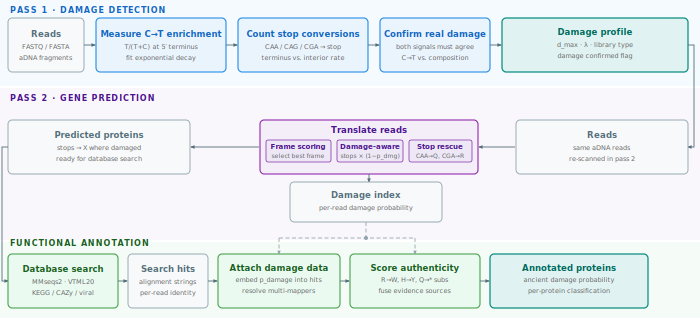
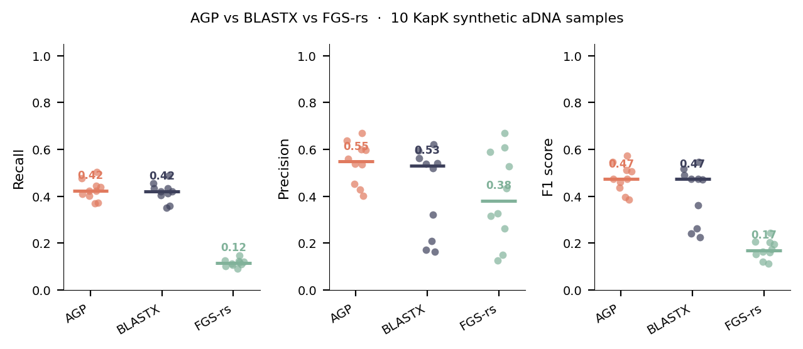
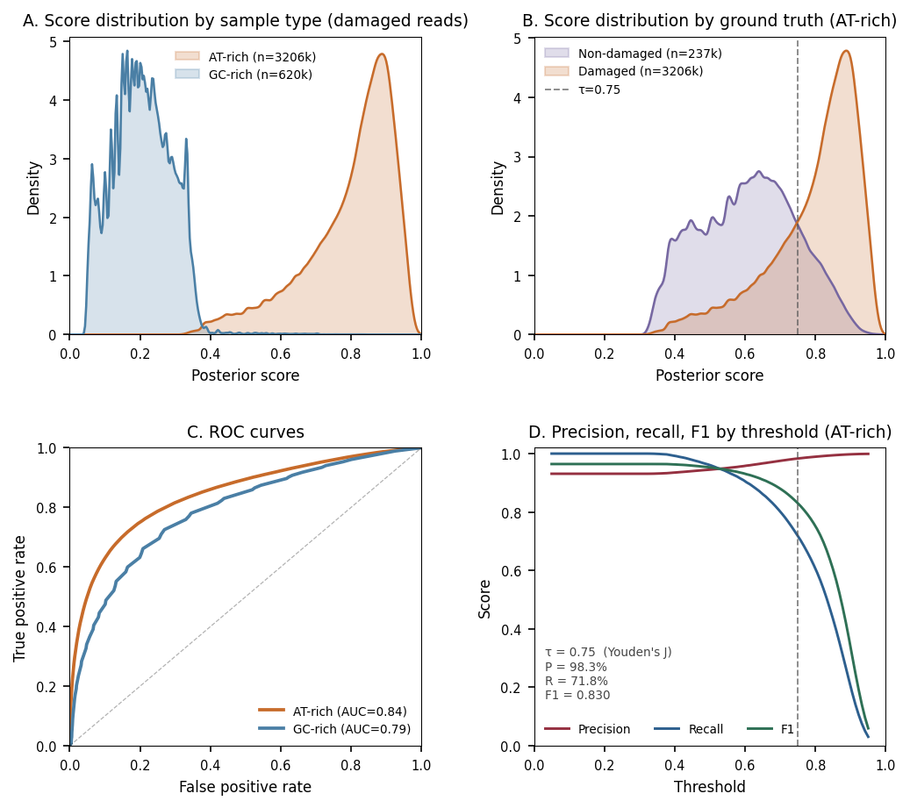
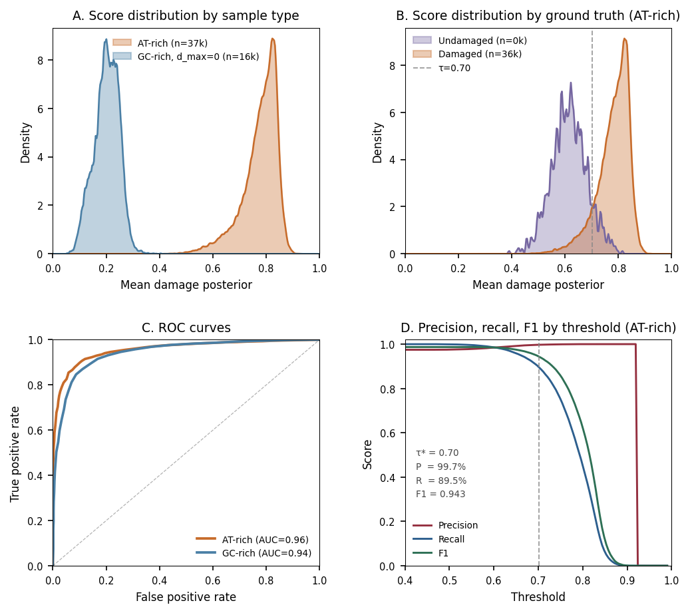
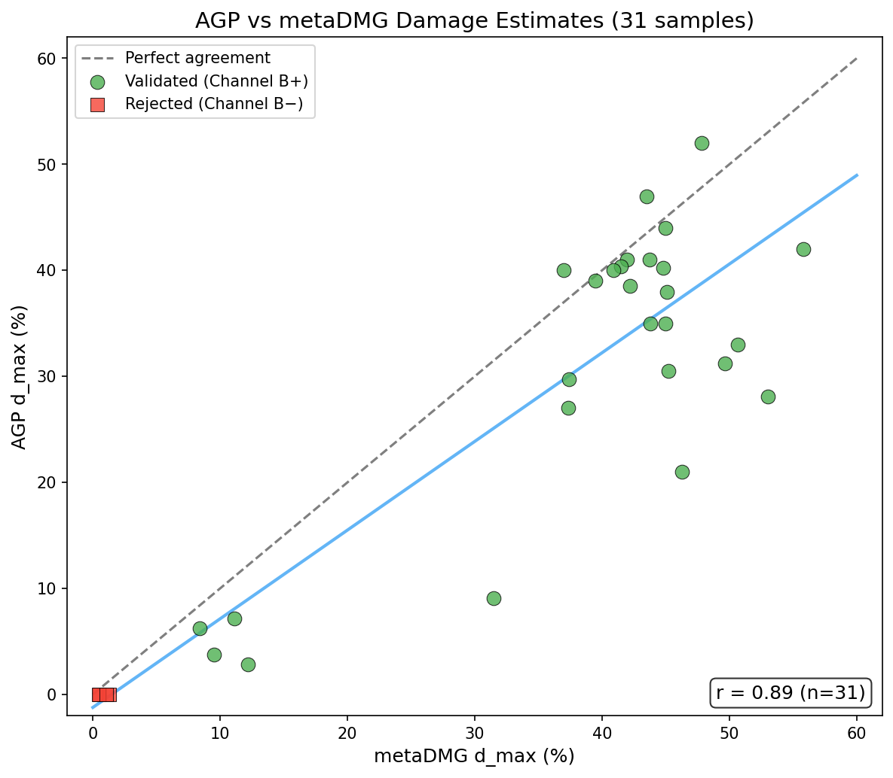

# AGP: Ancient Gene Predictor

[](https://opensource.org/licenses/MIT)

AGP translates ancient DNA (aDNA) reads into proteins for functional annotation. It predicts protein-coding genes from short, degraded metagenomic sequences while accounting for post-mortem DNA damage that corrupts standard translation.

## Overview

<p align="center">

</p>

The pipeline runs in three stages. **Pass 1** scans all reads to measure the sample's damage level. **Pass 2** translates reads into proteins using that damage estimate to rescue genes that would otherwise be missed. **Functional annotation** searches those proteins against databases and scores each hit for authentic ancient damage.

---

## The problem: ancient DNA is chemically damaged

DNA degrades after death. The most common change is **deamination**: cytosines (C) spontaneously convert to uracil, which reads as thymine (T) during sequencing [Lindahl 1993]. This happens most at the *ends* of DNA fragments. Damage accumulates over time, but the rate is strongly modulated by preservation conditions (temperature, pH, water activity), so damage level reflects depositional environment as much as age [Briggs et al. 2007].

This causes two practical problems for bioinformatics:

1. **False stop codons.** A C→T change at certain codon positions turns a coding codon into a stop codon (e.g., CAA → TAA). Standard gene predictors see the stop and truncate or discard the gene — even though the *real* sequence had no stop there. A heavily damaged ancient sample can lose 30–50% of its genes this way.

2. **False positives.** Some modern samples happen to be rich in T at read termini due to biology, not damage. Naively measuring "how much T is at the ends" gives a false alarm. AGP uses a second, independent signal — stop codon conversion rates — to confirm whether the enrichment is real damage or just natural sequence composition.

---

## How it works

### Step 1 — Measure damage without a reference genome

AGP scans all reads *before* any gene prediction to estimate how damaged the sample is. It uses two independent signals:

**Channel A — terminal nucleotide frequencies.** In a damaged sample, C→T events increase the fraction of T at read ends. AGP measures T/(T+C) at each position from the 5′ terminus and fits an exponential decay curve. The amplitude at position 0 is `d_max` (maximum damage rate), and the decay constant is `λ`.

**Channel B — stop codon conversion.** Codons CAA, CAG, and CGA are one C→T change away from becoming stop codons. AGP counts these stop-codon conversions separately at terminal versus interior positions. Real damage produces *more* stops near the ends. Natural composition variation does not — it produces equally elevated stops everywhere.

If Channel A fires but Channel B is flat, the sample is flagged as a **compositional artifact** and `d_max` is set to zero. This prevents false positives in AT-rich organisms where terminal T enrichment is biological rather than chemical.

The output is a `SampleProfile` — a compact damage model with `d_max`, decay constant `λ`, library type (single- or double-stranded), and a `damage_validated` flag.

### Step 2 — Translate reads with damage awareness

Standard six-frame translation fails on ancient DNA because damage-induced stop codons break reading frames. AGP rescues genes in two ways:

**Damage-aware frame scoring.** Each candidate reading frame is scored using codon usage, hexamer patterns, and amino acid composition. In damage-aware mode, stop codons near the 5′ end are penalised less if they sit at positions where the sample's damage model predicts a high probability of C→T conversion. A stop that is 80% likely to be a damage artifact barely hurts the frame score; a stop in the middle of a long interior region counts heavily.

**Stop codon masking.** Stops with high damage probability are replaced by `X` in the output protein sequences (`--fasta-aa-masked`). This lets MMseqs2 search across the damaged position and match the true reference protein, recovering alignments that would otherwise fail.

Every read is assigned `p_read` — the probability that its terminal pattern reflects authentic ancient damage — stored in a binary index (`.agd`) for use downstream.

### Step 3 — Search and score damage authenticity

Predicted proteins are searched against a reference database (KEGG, CAZy, viral proteins, etc.) with MMseqs2 [Steinegger & Söding 2017] using VTML20 [Müller & Vingron 2000], a low-divergence substitution matrix that penalises conservative amino acid changes less heavily than BLOSUM62, which suits the short, identity-preserving alignments typical of ancient DNA.

After search, `damage-annotate` scores each protein hit for authentic ancient damage using three lines of evidence fused in log-odds space:

**Terminal evidence (BF_terminal).** The per-read `p_read` from Pass 2.

**Site evidence (BF_sites).** The alignment is inspected for amino acid substitutions that are consistent with C→T or G→A damage: R→W, H→Y, Q→*, E→K, D→N, R→K. Each such substitution at a position near the read terminus contributes positive evidence; substitutions in the interior, where damage is rare, contribute near-zero evidence.

**Identity evidence (BF_identity).** Ancient proteins match their reference proteins *better* than modern spurious hits do, because they come from organisms genuinely related to the reference. Alignment identity above 0.90 provides modest positive evidence; low identity provides negative evidence.

EM reassignment resolves multi-mapping reads — reads that hit multiple reference proteins — by distributing them probabilistically based on alignment scores and damage probability, converging in 5–15 iterations.

The final output is a per-protein Bayesian posterior: the probability that a protein's read support reflects authentic ancient DNA rather than modern contamination or noise.

---

## Installation

Requires C++20 compiler (GCC 10+ or Clang 12+), CMake 3.18+, and zlib.

```bash
git clone https://github.com/genomewalker/agp.git
cd agp
mkdir build && cd build
cmake -DCMAKE_BUILD_TYPE=Release ..
make -j$(nproc)
```

---

## Quick start

### Sample damage assessment

Before gene prediction, check whether the sample shows authentic ancient damage:

```bash
agp sample-damage reads.fq.gz
```

Output (JSON):
```json
{
  "d_max": 0.25,
  "lambda": 0.3,
  "damage_validated": true,
  "library_type": "double-stranded"
}
```

### Full functional profiling pipeline

```bash
# 1. Predict genes with damage model — produces proteins and damage index
agp predict -i reads.fq.gz -o out.gff \
    --fasta-aa-masked search.faa \
    --damage-index out.agd \
    --adaptive

# 2. Search against a reference database with aDNA-optimized settings
mmseqs easy-search search.faa kegg_genes.faa hits.tsv tmp/ \
    --sub-mat VTML20.out \
    --format-output "query,target,fident,alnlen,mismatch,gapopen,qstart,qend,tstart,tend,evalue,bits,qlen,tlen,qaln,taln"

# 3. Convert hits to columnar index (embeds damage probabilities)
agp hits2emi -i hits.tsv -o hits.emi --damage-index out.agd -t 16

# 4. Annotate hits with per-protein Bayesian damage scores
agp damage-annotate --emi hits.emi -o annotated_hits.tsv -t 16
```

The `--fasta-aa-masked` output replaces damage-induced stop codons with X so MMseqs2 can align across them.

---

## Commands

### `agp predict`

Translates reads into proteins with damage-aware frame selection.

```
Usage: agp predict -i <input> -o <output> [options]

Required:
  -i, --input FILE       Input FASTQ/FASTA (gzip supported)
  -o, --output FILE      Output GFF3

Output:
  --fasta-aa FILE        Protein sequences (observed translation)
  --fasta-aa-masked FILE Protein sequences (damage stops masked as X)
  --fasta-nt FILE        Nucleotide sequences
  --damage-index FILE    Binary index for damage-annotate (.agd)
  --summary FILE         Sample statistics (JSON)

Parameters:
  --adaptive             Adaptive damage correction (recommended)
  --domain NAME          Taxonomic domain: gtdb, fungi, plant, viral,
                         vertebrate_mammalian, vertebrate_other,
                         invertebrate, protozoa (default: gtdb)
  --orf-min-aa N         Minimum protein length (default: 10)
  -t, --threads N        Thread count (default: auto)
```

### `agp sample-damage`

Estimates sample-wide damage rate without gene prediction.

```
Usage: agp sample-damage <input.fq.gz> [options]

Output fields:
  d_max              Maximum damage rate at read termini (0-1)
  lambda             Exponential decay constant
  damage_validated   True if damage confirmed by stop codon signal
  library_type       single-stranded or double-stranded
```

### `agp hits2emi`

Converts MMseqs2 hit TSV into AGP EMI (columnar) with alignment strings (`qaln`, `taln`) required by `damage-annotate`.

```
Usage: agp hits2emi -i <hits.tsv[.gz]> -o <hits.emi> [options]

Required:
  -i, --tsv FILE         MMseqs2 16-column hits TSV (plain or gz)
  -o, --output FILE      Output EMI file

Options:
  -t, --threads N        Thread count (default: all available)
  -m, --memory SIZE      Memory budget with required K/M/G/T suffix (default: 10% available RAM)
  --streaming            Force streaming mode
  --damage-index FILE    Optional AGD; embeds per-read damage probability into EMI
  --d-max FLOAT          Store sample d_max in EMI metadata
  --lambda FLOAT         Store decay lambda in EMI metadata
```

### `agp damage-annotate`

Annotates database hits with per-protein damage evidence. Compares observed proteins to reference proteins to identify damage-consistent amino acid substitutions (R→W, H→Y, Q→*, etc.).

```
Usage: agp damage-annotate --emi <hits.emi> -o <output.tsv> [options]

Required:
  -i, --emi FILE         EMI index from `agp hits2emi` (with qaln/taln)

Optional:
  -t, --threads INT      OpenMP threads for EMI scans
  --protein-summary FILE Per-protein aggregated statistics
  --protein-filtered FILE Per-protein subset that passes mapping-pattern filters
  --combined-output FILE Per-target combined protein+gene summary
  --blast8-unique FILE   BLAST8-like export with unique mappers only (no multimaps)
  --analysis-prefix STR  Output prefix: .reads.tsv, .protein.tsv, .blast8.unique.tsv,
                         and .categories.tsv (if --map is provided)
  --gene-summary FILE    Per-protein/gene mapping summary (coverage/diversity metrics)
  --map FILE             Gene-to-group mapping TSV (gene_id<TAB>group)
  --functional-summary FILE  Per-group stats TSV (includes category damage enrichment)
  --anvio-ko FILE        Gene-level group abundance for anvi-estimate-metabolism
  --annotation-source STR  Source label for anvi output (default: AGP)
  --preset STR           Apply filter bundle: loose or strict
  --min-reads INT        Minimum supporting reads for filtered outputs (default: 3)
  --min-breadth FLOAT    Minimum alignment breadth (default: 0.10)
  --min-depth FLOAT      Minimum mean depth (default: 0.5; set to 0 for ancient DNA)
  --prior-ancient FLOAT  Prior P(ancient) for Bayesian scorer (default: 0.10)
  --auto-prior-ancient   Auto-calibrate prior from mean p_read (requires AGD index)
  --min-damage-sites INT Min susceptible positions for site evidence (default: auto)
  --threshold FLOAT      Classification threshold for is_damaged (default: 0.7)
  --aln-min-identity F   Min alignment identity (default: 0, no filter)
  --aln-min-bits F       Min alignment bit score (default: 0, no filter)
  --aln-max-evalue F     Max alignment e-value (default: 1e10, no filter)
  --no-em                Disable EM reassignment (enabled by default)
  --em-iters INT         Max EM iterations (default: 100)
  --em-lambda FLOAT      EM score temperature (default: 3.0)
  --em-tol FLOAT         EM convergence tolerance (default: 1e-4)
  --em-min-prob FLOAT    Min EM responsibility to keep a read (default: 1e-6)
```

By default, `damage-annotate` resolves multi-mapping with integrated EM (SQUAREM-accelerated) directly on EMI alignments.

Output columns include:
- `p_read`: Per-read damage probability from prediction
- `ct_sites`, `ga_sites`: C→T and G→A substitution counts from alignment
- `posterior`: Bayesian damage probability combining terminal and alignment evidence
- `damage_class`: 3-state classification (damaged/uncertain/non-damaged)
- `is_damaged`: Binary classification (posterior >= threshold)

### Filtering and quality control

`damage-annotate` provides layered filtering. Filters apply in order: alignment → EM → coverage → scoring.

#### Quick presets

```bash
agp damage-annotate --emi hits.emi -o out.tsv --preset loose   # maximize recall
agp damage-annotate --emi hits.emi -o out.tsv --preset strict  # maximize precision
```

| Parameter | default | `--preset loose` | `--preset strict` |
|-----------|---------|-----------------|------------------|
| `--min-reads` | 3 | 1 | 5 |
| `--min-breadth` | 0.10 | 0 | 0.20 |
| `--min-depth` | 0.5 (set to 0 for aDNA) | 0 | 1.0 |
| `--min-positional-score` | 0 | 0 | auto-calibrated |
| `--min-terminal-ratio` | 0 | 0 | auto-calibrated |
| `--min-damage-sites` | auto | 1 | 5 |

Presets apply immediately in the argument list — individual flags placed after `--preset` override the preset value.

#### Alignment pre-filters

Applied before any processing. All disabled by default.

```bash
--aln-min-identity 0.90   # skip alignments below 90% identity
--aln-min-bits 30         # skip alignments below 30 bits
--aln-max-evalue 1e-3     # skip alignments with e-value above 1e-3
```

#### Coverage filters

Control which proteins appear in `--gene-summary` and `--protein-filtered` outputs.

```bash
--min-reads INT             # min reads per protein (default: 3)
--min-breadth FLOAT         # min alignment breadth, 0–1 (default: 0.10; gene summary only)
--min-depth FLOAT           # min mean depth (default: 0.5; gene summary only)
--min-positional-score FLOAT  # min read start diversity (default: 0 = off)
--min-terminal-ratio FLOAT    # min terminal/interior coverage ratio (default: 0 = off)
--auto-calibrate-spurious     # auto-derive pos-score and terminal-ratio from data
                              # (uses 5th percentile of well-supported proteins)
```

#### Bayesian scoring parameters

```bash
--prior-ancient FLOAT     # prior P(ancient) for Bayesian scorer (default: 0.10)
--auto-prior-ancient      # auto-calibrate prior from mean p_read distribution
--min-damage-sites INT    # min susceptible AA positions to use site evidence
                          # (default: auto = max(1, median_qlen / 10))
```

`--prior-ancient` sets P(protein is ancient) for the Bayesian scorer. The default of 0.10 is conservative; increase it for samples expected to be predominantly ancient.

`--auto-prior-ancient` derives the prior empirically from the data. It computes E[p_read] across all reads in the alignment file as an empirical Bayes estimate of the fraction that is ancient. Requires a binary AGD index (from `agp predict --damage-index`); if no p_read data is available, the explicit `--prior-ancient` value is used unchanged. Useful when the ancient/modern fraction varies across samples.

`--min-damage-sites` auto-derives from the median query length in the data: short-read samples (15 aa median) get a lower threshold (1–2) while longer-read samples (50+ aa) use a higher threshold (5+). Override explicitly when needed.

#### EM filter

```bash
--em-min-prob FLOAT   # min EM responsibility to keep a read (default: 1e-6)
--no-em               # disable EM entirely (use best-hit only)
```

The EM filter keeps only reads where the best-hit protein's responsibility exceeds `--em-min-prob`. The default (1e-6) is effectively off — only use this to discard reads that are completely unassigned by EM.

#### Classification threshold

```bash
--threshold FLOAT   # posterior cutoff for is_damaged column (default: 0.7)
```

This controls only the `is_damaged` label in the output — it does not exclude any rows. To filter the output by damage score, post-filter on the `posterior` column.

---

### `agp damage-profile`

Computes position-wise damage profiles for proteins with sufficient coverage.

```
Usage: agp damage-profile -i <reads.fq> --hits <hits.tsv> -o <profile.tsv.gz>

Options:
  --aggregate        Position-wise summary across all proteins
  --min-reads N      Minimum reads per protein (default: 10)
```

### `agp validate`

Compares predictions against ground truth for benchmarking.

```
Usage: agp validate <fastq.gz> <aa-damage.tsv.gz> <predictions.gff> [proteins.faa] [corrected.faa] [--csv output.csv]
```

---

## Output formats

### GFF3

```
read_001  AGP  CDS  1  150  0.85  +  0  ID=gene_1;ancient_prob=0.72;damage_pct=15.3;conf=0.88
```

| Attribute | Description |
|-----------|-------------|
| ancient_prob | Probability read shows damage pattern (0-1) |
| damage_pct | Estimated damage percentage |
| conf | Prediction confidence from length and coding score |

### Damage Index (.agd)

Binary format for O(1) per-read damage lookup. Contains sequence length, frame, strand, damage probability, and terminal codon information. Required by `damage-annotate`.

### EMI (.emi)

Columnar alignment index consumed by `damage-annotate`. Stores MMseqs2 alignments in a memory-efficient columnar layout optimised for streaming EM and damage annotation.

**Key columns:**

| Column | Type | Description |
|--------|------|-------------|
| query_id | string | Read identifier |
| target_id | string | Reference protein ID |
| fident | float32 | Fractional sequence identity |
| bits | float32 | Bit score |
| qaln | string | Query alignment string (required for damage detection) |
| taln | string | Target alignment string |
| p_read | float32 | Pre-mapping damage probability (from AGD) |

### Annotated Hits TSV

Per-read output from `damage-annotate`:

| Column | Description |
|--------|-------------|
| p_read | Per-read damage probability from AGP predict |
| ct_sites | C→T substitution count at protein level |
| ga_sites | G→A substitution count at protein level |
| posterior | Bayesian posterior probability of damage |
| is_damaged | 1 if posterior >= threshold |
| em_keep | 1 if read assignment passes EM posterior filter |
| gamma | EM responsibility for the selected target |

---

## Benchmark

### Gene prediction

Benchmarked on 18.3 million synthetic ancient DNA reads from the KapK community (10 samples, known source proteins). A prediction is counted as correct if it matches any reference protein at ≥90% sequence identity.

**Functional matching (≥90% identity):**

| Method | Recall | Precision | Avg Identity |
|--------|--------|-----------|--------------|
| AGP | 67.6% | **97.2%** | **96.2%** |
| MMseqs2 blastx [Steinegger & Söding 2017] | **68.5%** | 96.3% | 94.8% |
| FGS-rs [Van der Jeugt et al. 2022] | 19.1% | 95.3% | 94.2% |

**Timing (4.4M reads, 8 threads):**

| Method | Predict | Search | Total |
|--------|---------|--------|-------|
| AGP | 149 s | 4 min | ~6.5 min |
| MMseqs2 blastx | N/A | 10 min | ~10 min |
| FGS-rs | ~18 s | 4 min | ~4.5 min |

AGP and BLASTX have equivalent functional recall (~68%), both far exceeding FGS-rs (19%). FGS-rs treats damage-induced stop codons as real stops, discarding most ancient reads. AGP produces 1.4% higher identity hits than BLASTX and runs ~1.5× faster. Throughput: ~35,000 sequences/second (8 threads, SIMD).

<p align="center">

</p>

### Read-level damage classification

`damage-annotate` assigns a per-read Bayesian posterior using terminal damage signal, alignment site evidence, and sequence identity. Evaluated on 3.4 million reads from 10 synthetic KapK samples (8 with ≥50 non-damaged reads):

| Group | AUC-ROC | P/R/F1 @ optimal τ |
|-------|---------|---------------------|
| AT-rich | **0.844** | 98.3% / 71.8% / 0.830 @ τ=0.75 |
| GC-rich | 0.788 | — (see note below) |
| Overall | 0.851 | |

<p align="center">

</p>

### Protein damage classification

After EM reassignment, `damage-annotate` computes `assign_mean_posterior` — the EM-weighted mean posterior across all reads assigned to a protein. Evaluated on 61,945 proteins (8 samples, ≥50 non-damaged proteins each):

| Group | AUC-ROC | P/R/F1 @ optimal τ |
|-------|---------|---------------------|
| AT-rich | **0.948** | 99.3% / 87.4% / 0.930 @ τ=0.70 |
| GC-rich | 0.938 | — (see note below) |
| Overall | 0.875 | |

<p align="center">

</p>

Averaging over multiple reads per protein substantially improves discrimination (+10% AUC for AT-rich, +15% for GC-rich).

**Note on GC-rich samples and threshold selection.** C→T deamination creates a T/(T+C) terminal enrichment proportional to `d_max × (1 − baseline_C)`. In GC-rich organisms (baseline C ~27%), this enrichment is inherently weak even at high damage rates — AGP correctly sets d_max ≈ 0, and discrimination relies on alignment identity and EM posterior evidence rather than a damage magnitude signal. Consequently, a single classification threshold appropriate for AT-rich samples (where `d_max > 0`) is not meaningful for GC-rich samples. We therefore report precision/recall/F1 for AT-rich samples only; GC-rich performance is captured by AUC-ROC (threshold-independent). In practice, AGP reports `d_max` per sample, allowing users to apply regime-specific thresholds.

**Recommended thresholds for real data:**
- AT-rich samples (d_max > 0): τ = **0.70** at protein level, τ = **0.75** at read level
- GC-rich samples (d_max ≈ 0): rely on AUC/ROC; any threshold is sample-specific

### Sample-wide damage detection

AGP estimates sample-wide damage without reference alignment. Validated against metaDMG [Michelsen et al. 2022] on 31 real ancient metagenomes:

| Sample | metaDMG (%) | AGP d_max (%) | Channel B LLR | Decision |
|--------|-------------|---------------|---------------|----------|
| low_001 | 0.48 | 0.00 | −24,707 | No damage (artifact) |
| low_005 | 8.37 | 6.27 | +808 | Validated |
| low_009 | 31.47 | 9.06 | +39,631 | Validated |
| 69_34 | 39.50 | 39.00 | +5,332,371 | Validated |
| 119_48 | 44.98 | 44.00 | +3,818,288 | Validated |

<p align="center">

</p>

Correlation r = 0.81 across the full 0–55% damage range. The +4.4% bias reflects different estimands: metaDMG analyses only aligned reads while AGP analyses all reads. Channel B prevents false positives — samples low_001–low_004 show elevated terminal T/(T+C) but negative Channel B LLR, correctly rejected as compositional artifacts.

---

## Methods

### Damage model

Post-mortem deamination hydrolytically removes the amine group from cytosine, converting it to uracil (read as thymine) [Lindahl 1993]. This reaction preferentially affects single-stranded overhangs at fragment termini, producing a characteristic gradient of C→T substitutions at 5′ ends and, in double-stranded libraries, complementary G→A substitutions at 3′ ends [Briggs et al. 2007]. The rate follows exponential decay from the terminus:

$$\delta(p) = d_{\max} \cdot e^{-\lambda p}$$

$d_{\max}$ is the substitution rate at the outermost position, reflecting both the age of the sample and preservation conditions. $\lambda$ is the decay constant (typically 0.2–0.5 nats/position), controlling how deep into the read the damage signal extends. The characteristic half-life is $t_{1/2} = \ln(2) / \lambda$, roughly 1.4 to 3.5 positions. AGP estimates both parameters from the data in Pass 1, fitting the observed T/(T+C) profile to this model via maximum likelihood.

Single-stranded library preparation (e.g. uracil-tolerant protocols, without UDG treatment) typically shows the full 5′ C→T gradient independently on both strands. Double-stranded protocols show a mirror-image pattern: 5′ C→T and 3′ G→A, though the exact profile depends on UDG treatment and ligation chemistry.

### Two-channel damage validation

Reference-free damage detection faces a fundamental ambiguity: elevated terminal T/(T+C) can result from either genuine C→T deamination **or** a high baseline T content in the organism's genome (compositional confounding). AGP resolves this with two independent channels that respond differently to each cause.

**Channel A: nucleotide frequency enrichment**

Channel A measures the ratio of T to total pyrimidines at each terminal position $p$:

$$r_A(p) = \frac{T_p}{T_p + C_p}$$

Under the damage model, the expected value is:

$$\mathbb{E}[r_A(p)] = b_T + (1 - b_T) \cdot d_{\max} \cdot e^{-\lambda p}$$

where $b_T$ is the organism's genomic T/(T+C) baseline measured from read interiors. Channel A fires when the terminal profile is significantly elevated above $b_T$ with exponential shape (measured by a log-likelihood ratio test, $\Delta \text{LLR}_A$).

*Limitation:* An AT-rich organism will have a naturally high $b_T$, and any additional damage-driven enrichment sits on top of a noisy baseline. Channel A alone cannot distinguish the two.

**Channel B: stop codon conversion**

Channel B exploits the fact that only three sense codons contain a C that, when converted to T, produces a stop codon: CAA→TAA (Gln→ochre), CAG→TAG (Gln→amber), and CGA→TGA (Arg→opal). These are the **preimage** of the stop set under C→T substitution. The conversion rate at position $p$ is:

$$r_B(p) = \frac{\text{stops}_p}{\text{stops}_p + \text{preimage}_p}$$

where $\text{stops}_p$ counts in-frame stop codons observed at codon position $p$ from the terminus and $\text{preimage}_p$ counts the surviving CAA/CAG/CGA codons at that position. If C→T damage is present, $r_B$ will be elevated at terminal positions relative to interior positions (a positive $\Delta \text{LLR}_B$). Crucially, Channel B is not elevated by genomic T-richness: a high-T genome has fewer C residues in CAA/CAG/CGA, but this equally depletes both numerator and denominator, leaving $r_B$ unchanged. It can, however, be affected by very low coverage of convertible codons, alternative genetic codes, or terminal sequencing artifacts, so Channel B reports a confidence flag (`channel_b_valid`) alongside the LLR.

**Joint decision**

| Channel A | Channel B | Interpretation |
|-----------|-----------|----------------|
| Fires | Fires | Validated damage ($d_{\max}$ reported) |
| Fires | Flat or negative | Compositional artifact ($d_{\max} = 0$) |
| Silent | n/a | No detectable damage ($d_{\max} = 0$) |

This design substantially reduces false positives from AT-rich organisms (the most common failure mode of reference-free damage detection) while retaining sensitivity in validated samples.

### Per-read damage scoring

Each read receives an individual damage probability $p_{\text{read}}$ that quantifies the likelihood of observing its terminal nucleotide composition given the sample-wide damage model. This is computed as a log-likelihood ratio (LLR) summed over terminal positions:

$$\text{LLR} = \sum_{i \in \text{terminal}} \log \frac{P(B_i \mid \text{damage}, \delta(i))}{P(B_i \mid \text{no damage}, b_T)}$$

where $B_i$ is the observed base at position $i$, $P(B_i \mid \text{damage}) = (1 - \delta(i)) \cdot b_T + \delta(i)$ for T observations (a T could be original or damage-converted), and $P(B_i \mid \text{no damage}) = b_T$. The LLR is converted to a posterior via a Bayesian update starting from the sample-level prior $\pi_0$:

$$p_{\text{read}} = \gamma_B \cdot \sigma\!\left(\text{logit}(\pi_0) + \text{LLR}\right)$$

The modulation factor $\gamma_B \in \{0, 0.5, 1\}$ suppresses per-read scores for samples where Channel B validation failed (no real damage) or is inconclusive, preventing the score from conveying false confidence when the sample-level signal is absent.

### Bayesian damage score

After alignment, each detected protein accumulates evidence from all its covering reads. A Bayesian log-odds fusion combines three statistically independent evidence sources:

$$\text{logit}(P_{\text{posterior}}) = \text{logit}(\pi) + \log BF_{\text{terminal}} + \log BF_{\text{sites}} + \log BF_{\text{identity}}$$

**Terminal evidence ($BF_{\text{terminal}}$):** Derived from $p_{\text{read}}$ for all reads covering the protein. The Bayes factor converts the terminal nucleotide signal into a likelihood ratio relative to the sample-level prior:

$$\log BF_{\text{terminal}} = \text{logit}(p_{\text{read}}) - \text{logit}(\pi_0)$$

**Site evidence ($BF_{\text{sites}}$):** Counts damage-consistent amino acid substitutions in the alignment (those caused by C→T: R→W, H→Y, Q→\*, S→L; and by G→A: E→K, D→N) and compares their rate to a background mismatch rate $q_0$:

$$\log BF_{\text{sites}} = k \cdot \log\frac{0.5 \cdot 0.30 \cdot d_{\max} + q_0}{q_0}$$

where $k$ is the count of damage-consistent mismatches, $q_0 = 0.005$ is the baseline rate of such substitutions in modern proteins, and the factor 0.30 converts the nucleotide-level $d_{\max}$ to the amino acid level (only ~30% of C→T events in a codon are non-synonymous). This term is particularly valuable for GC-rich organisms where Channel A alone is weak.

**Identity evidence ($BF_{\text{identity}}$):** In the KapK benchmark, ancient proteins aligned at higher identity to reference databases than spurious matches (mean 93.3% vs 90.5%), likely because genuine ancient reads come from organisms closely related to sequenced reference genomes. The Bayes factor is:

$$\log BF_{\text{identity}} = 20 \times (\text{fident} - 0.90), \quad \text{capped at} \pm 5$$

calibrated so that a 93.3% identity alignment (mean ancient) contributes $+\log BF \approx +0.66$ nats relative to 90.5% (mean modern/spurious), and proteins below 90% identity are penalised.

Additive fusion in log-odds space assumes the three Bayes factors are conditionally independent given damage status. Terminal patterns, alignment column composition, and overall identity are driven by different physical processes, making this a reasonable working assumption, though residual correlations (e.g. from reference database biases) are possible.

### EM multi-mapping resolution

In complex metagenomes, short reads often align equally well to multiple reference proteins. AGP uses Expectation-Maximisation (EM) [Dempster et al. 1977] to redistribute ambiguous reads based on reference abundance.

**E-step:** Compute soft assignments (responsibilities) for each read $i$ to reference $j$:

$$\gamma_{ij} = \frac{\phi_j \cdot L(i,j)}{\sum_{k \in \mathcal{R}_i} \phi_k \cdot L(i,k)}$$

The likelihood $L(i,j) = \exp(\beta \cdot S_{ij})$ is an exponential weighting of the alignment bit score $S_{ij}$ by inverse-temperature $\beta$ (default 1.0); larger $\beta$ sharpens assignment towards the best hit, smaller $\beta$ spreads weight more uniformly. The set $\mathcal{R}_i$ contains all references that read $i$ aligns to within the score window.

**M-step:** Update reference abundances with a Dirichlet prior $\alpha_0$ for regularisation:

$$\phi_j = \frac{\alpha_0 + \sum_i \gamma_{ij}}{J \cdot \alpha_0 + N}$$

where $J$ is the number of references and $N$ the total read count. The prior prevents zero-count collapse and smooths abundance estimates for low-coverage references.

Convergence is assessed by the relative change in log-likelihood between iterations; SQUAREM acceleration [Varadhan & Roland 2008] is applied to speed convergence. In practice, 5–15 iterations suffice. Reads with final responsibility $\gamma_{ij} < \epsilon$ (default $\epsilon = 10^{-6}$, `--em-min-prob`) are pruned, reducing memory and noise in downstream damage annotation.

### Frame scoring

AGP evaluates all six reading frames for each read and selects the frame with the highest composite coding score. The score is a weighted product of signals:

| Signal | Weight | Description |
|--------|--------|-------------|
| Codon usage bias | 0.15 | Log-likelihood of codon frequencies vs null |
| Stop codon penalty | 0.28 | Multiplicative: 1.0 (no stops) → 0.2 (one stop) → 0.05 (multiple) |
| Dicodon/hexamer patterns | 0.13 | Adjacent codon pair frequencies |
| Amino acid composition | 0.10 | Global AA frequency match |
| GC3 content | 0.05 | GC at third codon position (coding bias indicator) |
| Damage-frame consistency | variable | Bonus when damage sites align with predicted frame |

The stop codon penalty is multiplicative (not additive) to prevent a single downstream stop from completely masking an otherwise well-supported long ORF. In damage-aware mode, each in-frame stop codon is weighted by $(1 - P_{\text{damage}}(p))$ where $P_{\text{damage}}(p) = d_{\max} \cdot e^{-\lambda p}$ at codon position $p$. A stop codon near the 5′ end of a highly damaged read contributes very little penalty; the model accepts it as likely a damage artefact rather than a true stop.

### Coverage quality filters

Two optional filters (`--min-positional-score` and `--min-terminal-ratio`) reject proteins whose read coverage pattern is inconsistent with random fragmentation of a real gene. Both default to 0 (off) and can be set automatically with `--auto-calibrate-spurious`, which uses the 5th percentile of well-supported proteins (≥10 reads, ≥3 unique starts) as the threshold.

**Positional score (`--min-positional-score`)**

When many reads align to a short conserved sequence motif rather than a full gene, they all pile up at the same position on the reference protein. The positional score detects this by measuring how spread out read start positions are:

$$s_{\mathrm{pos}} = \sqrt{d_{\mathrm{uniq}} \cdot w_{\mathrm{span}}}$$

$$d_{\mathrm{uniq}} = \frac{|\mathcal{S}|}{\min(n,\; L)} \qquad w_{\mathrm{span}} = \frac{p_{\max} - p_{\min} + 1}{L}$$

$|\mathcal{S}|$ is the number of distinct alignment start positions, $n$ is the read count, $L$ is the reference protein length in amino acids, and $p_{\max}, p_{\min}$ are the outermost and innermost observed start positions. $d_{\mathrm{uniq}}$ measures how many distinct start positions are used relative to the maximum possible. $w_{\mathrm{span}}$ measures how far apart the outermost starts are relative to the protein length. The geometric mean requires both to be simultaneously high.

```
              reference protein (100 aa)
              |------------------------------------------|

Spurious      ▼▼▼▼▼▼▼▼▼▼▼
(motif hit)   reads pile up near one position
              w_span = 0.12,  d_uniq = 0.55
              s_pos = sqrt(0.12 * 0.55) = 0.26   FAIL

Authentic     ▼   ▼  ▼    ▼   ▼    ▼   ▼   ▼  ▼    ▼
(real gene)   reads start at many positions across protein
              w_span = 0.88,  d_uniq = 1.00
              s_pos = sqrt(0.88 * 1.00) = 0.94   PASS
```

**Terminal ratio (`--min-terminal-ratio`)**

A conserved internal domain attracts reads that align only to the middle of a reference, leaving the terminal regions uncovered. The terminal ratio compares mean coverage depth in the outermost 10% of the protein at each end against the interior:

$$\rho = \frac{\bar{c}_{\mathrm{term}}}{\bar{c}_{\mathrm{mid}}}$$

where the terminal zone width is $e = \mathrm{clamp}(\lfloor L/10 \rfloor,\; 1,\; \lfloor L/2 \rfloor)$ residues at each end. Coverage is accumulated as the EM-weighted sum of alignment overlaps with each zone. A value above 1 means the termini are better covered than the interior; below 1 means the interior dominates.

```
     reference protein
     |-- edge --|----------- middle -----------|-- edge --|

Spurious    depth:  ▁▁           ▃▅████████▅▃           ▁▁
(interior           c_term ~ 0.5,  c_mid ~ 7
 domain)            rho = 0.5 / 7 = 0.07   FAIL

Authentic   depth:  ████        ████████████████        ████
(real gene)         c_term ~ 8,  c_mid ~ 9
                    rho = 8 / 9 = 0.89   PASS
```

The two filters are complementary: the positional score catches reads piled at any single location on the protein, while the terminal ratio catches reads that collectively avoid both ends.

| Filter | Detects | Spurious pattern |
|--------|---------|------------------|
| `--min-positional-score` | Reads clustered at one spot | Short conserved motif hit |
| `--min-terminal-ratio` | Reads avoiding both ends | Interior conserved domain |

### Domain-specific models

| Domain | Source | CDS sequences | Description |
|--------|--------|---------------|-------------|
| gtdb | GTDB r220 | 405 M | Bacteria and archaea (default) |
| fungi | RefSeq | 6.8 M | Fungal eukaryotes |
| plant | RefSeq | 9.2 M | Land plants |
| protozoa | RefSeq | 1.2 M | Single-celled eukaryotes |
| invertebrate | RefSeq | 12.9 M | Invertebrate animals |
| vertebrate_mammalian | RefSeq | 12.9 M | Mammals |
| vertebrate_other | RefSeq | 21.3 M | Non-mammalian vertebrates |
| viral | RefSeq | 0.7 M | Viruses |

---

## Citation

If you use AGP in your research, please cite:

> **Two-million-year-old microbial communities from the Kap København Formation in North Greenland**
> Fernandez-Guerra A, Wörmer L, Borrel G, Delmont TO, Elberling B, Elvert M, Eren AM, Gribaldo S, Henriksen RA, Hinrichs K-U, Jochheim A, Korneliussen TS, Krupovic M, Larsen NK, Perez-Laso R, Pedersen MW, Pedersen VK, Ruter AH, Sand KK, Sikora M, Steinegger M, Veseli I, Wang Y, Zhao L, Žure M, Kjær KH, Willerslev E.
> *bioRxiv* (2025)
> DOI: [10.1101/2023.06.10.544454](https://doi.org/10.1101/2023.06.10.544454)

```bibtex
@article{fernandezguerra2025,
  title={Two-million-year-old microbial communities from the Kap København Formation in North Greenland},
  author={Fernandez-Guerra, Antonio and W{\"o}rmer, Lars and Borrel, Guillaume and Delmont, Tom O and Elberling, Bo and Elvert, Marcus and Eren, A Murat and Gribaldo, Simonetta and Henriksen, Rasmus Amund and Hinrichs, Kai-Uwe and Jochheim, Annika and Korneliussen, Thorfinn S and Krupovic, Mart and Larsen, Nicolaj K and Perez-Laso, Rafael and Pedersen, Mikkel Winther and Pedersen, Vivi K and Ruter, Anthony H and Sand, Karina K and Sikora, Martin and Steinegger, Martin and Veseli, Iva and Wang, Yucheng and Zhao, Lei and {\v{Z}}ure, Marina and Kj{\ae}r, Kurt H and Willerslev, Eske},
  journal={bioRxiv},
  year={2025},
  doi={10.1101/2023.06.10.544454}
}
```

## References

- **Briggs et al. 2007** — Briggs AW, Stenzel U, Johnson PLF, Green RE, Kelso J, Prüfer K, Meyer M, Krause J, Ronan MT, Lachmann M, Pääbo S. Patterns of damage in genomic DNA sequences from a Neandertal. *PNAS* 104(37):14616–14621. [doi:10.1073/pnas.0704665104](https://doi.org/10.1073/pnas.0704665104)

- **Dempster et al. 1977** — Dempster AP, Laird NM, Rubin DB. Maximum likelihood from incomplete data via the EM algorithm. *J Royal Statistical Society B* 39(1):1–22. [doi:10.1111/j.2517-6161.1977.tb01600.x](https://doi.org/10.1111/j.2517-6161.1977.tb01600.x)

- **Jónsson et al. 2013** — Jónsson H, Ginolhac A, Schubert M, Johnson PLF, Orlando L. mapDamage2.0: fast approximate Bayesian estimates of ancient DNA damage parameters. *Bioinformatics* 29(13):1682–1684. [doi:10.1093/bioinformatics/btt193](https://doi.org/10.1093/bioinformatics/btt193)

- **Lindahl 1993** — Lindahl T. Instability and decay of the primary structure of DNA. *Nature* 362(6422):709–715. [doi:10.1038/362709a0](https://doi.org/10.1038/362709a0)

- **Michelsen et al. 2022** — Michelsen C, Pedersen MW, Fernandez-Guerra A, Zhao L, Petersen TC, Korneliussen TS. metaDMG: a fast and accurate ancient DNA damage toolkit for metagenomic data. *bioRxiv* preprint. [doi:10.1101/2022.12.06.519264](https://doi.org/10.1101/2022.12.06.519264)

- **Müller & Vingron 2000** — Müller T, Vingron M. Modeling amino acid replacement. *J Computational Biology* 7(6):761–776. [doi:10.1089/10665270050514918](https://doi.org/10.1089/10665270050514918)

- **Rho et al. 2010** — Rho M, Tang H, Ye Y. FragGeneScan: predicting genes in short and error-prone reads. *Nucleic Acids Research* 38(20):e191. [doi:10.1093/nar/gkq747](https://doi.org/10.1093/nar/gkq747)

- **Steinegger & Söding 2017** — Steinegger M, Söding J. MMseqs2 enables sensitive protein sequence searching for the analysis of massive data sets. *Nature Biotechnology* 35(11):1026–1028. [doi:10.1038/nbt.3988](https://doi.org/10.1038/nbt.3988)

- **Van der Jeugt et al. 2022** — Van der Jeugt F, Dawyndt P, Mesuere B. FragGeneScanRs: faster gene prediction for short reads. *BMC Bioinformatics* 23(1):198. [doi:10.1186/s12859-022-04736-5](https://doi.org/10.1186/s12859-022-04736-5)

- **Varadhan & Roland 2008** — Varadhan R, Roland C. Simple and globally convergent methods for accelerating the convergence of any EM algorithm. *Scandinavian J Statistics* 35(2):335–353. [doi:10.1111/j.1467-9469.2007.00585.x](https://doi.org/10.1111/j.1467-9469.2007.00585.x)

---

## License

MIT License — see LICENSE file for details.
